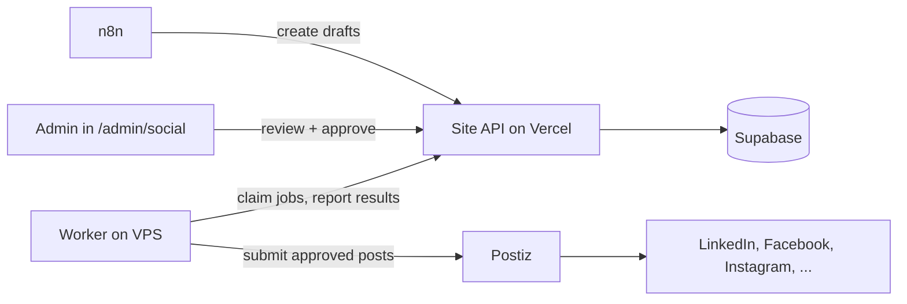
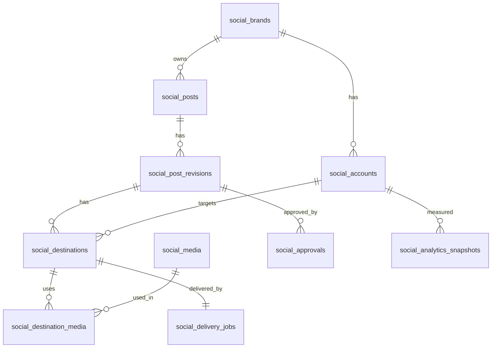

# social-infra

Infrastructure for cross-posting and automation behind `/admin/social` on thecrypto.support.

This repo contains the admin site, database migrations, approval rules and publishing worker, plus the local Postiz stack and infrastructure scripts. The site currently runs with local PGlite and TOTP login; Vercel, Supabase and VPS setup are documented for later deployment.

Status: local v1 implemented and tested. External platform connections and VPS deployment remain pending. Publishing requires admin approval.

Product requirements and the work split: [docs/PRD.md](docs/PRD.md). Where this README and the PRD differ, the PRD wins until this README is updated.

Current phase: **localhost MVP**, no VPS yet. See [docs/amendment-01-localhost-mvp.md](docs/amendment-01-localhost-mvp.md).

**Implemented:** the Next.js admin (`site/`) with local PGlite, TOTP, approval/scheduling, media/cards, accounts, manual handoff, overview and calendar; the worker's delivery and structured-generation loops with lease heartbeats; the Postiz + Temporal Docker stack (`local/`), prompts and dev scripts. The mock site remains a worker-test fixture. See [site/README.md](site/README.md) for the complete offline flow.

## How it fits together



Rules that never change:

1. n8n can only create drafts and report workflow results. It cannot approve or publish.
2. Supabase owns the schedule. n8n keeps no second schedule.
3. Only the worker holds a Postiz API key.
4. Postiz holds platform credentials. The site never sees them.
5. Approval is tied to the exact content, media, accounts and time. Any edit invalidates it.

## Repo layout

```
social-infra/
  package.json              root workspace (worker)
  local/
    docker-compose.yml       Postiz v2.25.0 + Postgres + Redis + Temporal
    .env.example
  site/                     Next.js admin, local database, media and worker API
  worker/
    src/
      loops/                 delivery, generator, sync
      services/              site-api, postiz-api, claude-api
      generator/             prompts, schema, validators, repair
      delivery/              hash (+ hash.test), the publish/poll/reconcile
                             handlers live in loops/delivery.ts
      utils/                 health
    test/
      mock-site.mjs          stands in for Track A's site (PRD task B9)
    .env.example
  prompts/
    facts.yaml, banned.txt, system.md, social.md
  scripts/
    dev-up.mjs, dev-down.mjs, health-check.mjs, backup-local.mjs
  card-templates/
    index.html               static brand-card design reference (not rendered by the worker)
  supabase/
    migrations/0001_social_schema.sql   reference copy; Track A owns the real one
  docs/
    PRD.md, amendment-01-localhost-mvp.md, setup.md, postiz-notes.md
    contracts/hash-vectors.json
  README.md
```

The VPS phase (Caddy, two subdomains, n8n, `.github/workflows/`) comes later — see "Moving to a server later" in the amendment.

## Services

| Service | Purpose | Notes |
| --- | --- | --- |
| Postiz | Platform connections, publishing, analytics | Pin the image version. Recent versions need Temporal |
| PostgreSQL + Redis | Postiz data and job queue | Not exposed publicly |
| Temporal | Workflow engine required by recent Postiz | Its own database |
| n8n | Automations that create drafts | Separate database and credentials |
| Worker | Claims approved jobs, submits to Postiz | Talks to the site over HTTPS |
| Caddy | HTTPS and reverse proxy | Two subdomains |

Domains (example, adjust to yours):

- `social.thecrypto.support` for Postiz
- `n8n.thecrypto.support` for n8n

Starting size (VPS phase): 4 vCPU, 8 GB RAM, persistent storage, EU region. Watch usage before upsizing.

## Running the localhost MVP

No VPS yet — see [docs/amendment-01-localhost-mvp.md](docs/amendment-01-localhost-mvp.md) for the full picture. Everything binds to `127.0.0.1`.

```bash
git clone git@github.com:<org>/social-infra.git
cd social-infra
npm install && npm install --prefix worker

cp local/.env.example local/.env      # fill in, never commit
cp worker/.env.example worker/.env    # fill in, never commit

node scripts/dev-up.mjs               # starts Postiz + Temporal (local/docker-compose.yml)
```

Then, in separate terminals:

1. Open http://localhost:4007, create the first Postiz user, generate a public API key (Settings > Public API), put it in `worker/.env` as `POSTIZ_API_KEY`. Set `DISABLE_REGISTRATION=true` in `local/.env` and restart the stack.
2. `node worker/test/mock-site.mjs` — stands in for Track A's site until it exists (PRD workstream B9). Seeds one delivery job and one generation request.
3. `cd worker && npm run dev` — the worker (delivery, generator, sync loops). Keep `WORKER_DRY_RUN=true` until you've connected a real throwaway account.
4. `node scripts/health-check.mjs` to check everything is up.

See [docs/setup.md](docs/setup.md) for per-platform connection steps.

## Environment

Only placeholders live in git (`.env` is git-ignored everywhere). Real values stay on each developer's or the publisher machine.

- [local/.env.example](local/.env.example) — Postiz JWT secret, registration toggle, provider credentials as each platform is connected.
- [worker/.env.example](worker/.env.example) — `SITE_BASE_URL`, `WORKER_TOKEN`, `POSTIZ_API_KEY`, `ANTHROPIC_API_KEY` (optional — the generator loop is skipped without it), loop intervals, `WORKER_DRY_RUN`.

In the VPS phase these move to Vercel/VPS env and gain `N8N_AUTOMATION_TOKEN`, `N8N_ENCRYPTION_KEY`, a real `POSTIZ_URL` domain, and n8n's own env — see the amendment, section 11.

## Publishing flow

1. n8n creates a draft through `/api/automation/social/v1/*`.
2. An admin edits and approves it in `/admin/social`. Approval stores a hash of the exact content.
3. Approval creates one delivery job per destination, in the same transaction.
4. The worker claims due jobs, checks the approval hash, and submits to Postiz.
5. The worker reports the Postiz ID, the result and the published URL per destination.

Failure handling:

- Definite transient failure: retry with backoff.
- Timeout or unknown result: mark `reconciling` and check Postiz before doing anything else. Never recreate a post that may exist.
- One platform failing never rolls back the others.
- Times are stored in UTC and shown in Europe/Bucharest.

## n8n workflows

| Workflow | What it does |
| --- | --- |
| Article to drafts | New blog article creates editable drafts with the canonical link |
| Campaign to draft | Admin-configured templates and calendars create drafts |
| Results to notifications | Failures and reconnect-needed alerts reach the admin |
| Analytics refresh | Daily metrics pull, weekly internal summary |

Conventions:

- Workflows change through pull requests, exported to `n8n/workflows/`. No editing in the UI on production.
- Authenticated webhooks, an event ID on every run, idempotent draft creation.
- Plain HTTP Request nodes against our own endpoints. The community Postiz node is not used for publishing, because it would hand n8n a key that bypasses approval.
- AI generation is off until the team decides otherwise.

## Platform coverage

| Platform | Mode at start |
| --- | --- |
| LinkedIn (company page) | Automatic after developer app approval |
| Facebook (page) | Automatic after developer app approval |
| Instagram | Automatic, needs a business or creator account linked to the Facebook page |
| X | Manual handoff, API is paid |
| TikTok | Manual handoff unless an eligible integration is approved |
| Others | Enabled only after verifying account type, permissions, free API access and formats |

Every account shows one of: connected, reconnect required, developer setup required, approval pending, manual publishing.

## Data model

The schema lives in the site repo as a Supabase migration (`0001_social_schema.sql`). Overview:

| Table | Purpose |
| --- | --- |
| `social_brands` | Brands, for example The Crypto Support, Comets of Web3 |
| `social_accounts` | Connected accounts, identified by provider account ID, many per platform |
| `social_media` | Uploaded images and videos, alt text, thumbnails |
| `social_posts` | A post and its overall status |
| `social_post_revisions` | Every edit creates a new revision |
| `social_destinations` | Per-account version of a revision: text, settings, time |
| `social_destination_media` | Ordered media per destination |
| `social_approvals` | Approval bound to a revision and a content hash |
| `social_delivery_jobs` | One job per destination, with lease, retries and Postiz result |
| `social_analytics_snapshots` | Metrics per account or destination, with an unavailable flag |
| `social_automation_runs` | n8n runs, unique per workflow and event ID |



Data rules:

- Row Level Security is on for every social table with no policies. Only server code using the service role can touch them. Browsers never write.
- A unique index on `social_delivery_jobs.destination_id` blocks duplicate submissions.
- Jobs are claimed with `for update skip locked` and a lease.
- An expired lease on a job that may already have reached Postiz goes to `reconciling`, not back to the queue.

## Security

- Admin-only endpoints use the existing admin auth, MFA and activity logging. No admin actions while impersonating a user.
- No Supabase service-role key, approval permission or Postiz key is ever given to n8n.
- Any new encrypted database secret uses the repo's `encrypt()` helper and joins its rotation procedure.
- `.env` never enters git. Pin container versions, no `latest`.

## Backups and restore

- Daily dumps of the Postiz, Temporal and n8n databases, plus volumes, through `scripts/backup.sh`.
- `scripts/restore.sh` and `docs/runbook.md` describe a full restore.
- Do one test restore on a clean machine before connecting real accounts.

## Implementation phases

- [x] 0a. Worker skeleton, Postiz/site/Claude API clients, delivery+generator+sync loops, content hash (JCS+SHA-256) verified against `docs/contracts/hash-vectors.json`, mock site API for end-to-end dry runs
- [ ] 0b. Local sandbox: run Postiz for real, create an API key, create a post through the API, check the real rate limit (task B3, `docs/postiz-notes.md`)
- [ ] 1. VPS, DNS, compose stack, HTTPS, backups with one test restore (deferred — localhost MVP first, see the amendment)
- [ ] 2. Developer apps and callback URLs, first real connection (dev.to/Hashnode first, then LinkedIn, Facebook, Instagram)
- [x] 3. Local site foundation: migrations, authenticated admin, worker API and publishing feature flag
- [x] 4. Local full flow: draft, media, approve, schedule, fake/dry-run publication and URL, plus manual handoff
- [ ] 5. n8n workflows (dropped from the localhost MVP, see the amendment)
- [ ] 6. Analytics, then enable remaining accounts one at a time

## Acceptance checks

- Non-admins, sessions without MFA and n8n credentials cannot approve or publish.
- Editing approved content invalidates the approval.
- Concurrent workers, repeated events and restarts create no duplicates.
- Ambiguous results require reconciliation.
- Expired connections and partial failures stay visible and recoverable.
- Large video uploads avoid Vercel payload limits.
- Scheduling survives Bucharest daylight-saving changes.
- Paid-only platforms never trigger automatic API charges.
- Every connected destination has a successful controlled test post. Manual destinations have a full handoff.
- Backups restore the services and their connections.

## Out of scope

Comments, inboxes, advertising and paid AI.

## Notes

- Postiz is AGPL-3.0. Running it unmodified behind its API is fine. Talk to the team before modifying it.
- Platform API rules are separate from Postiz. Check each platform's current terms before enabling it.
