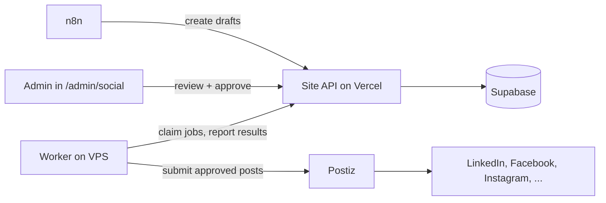
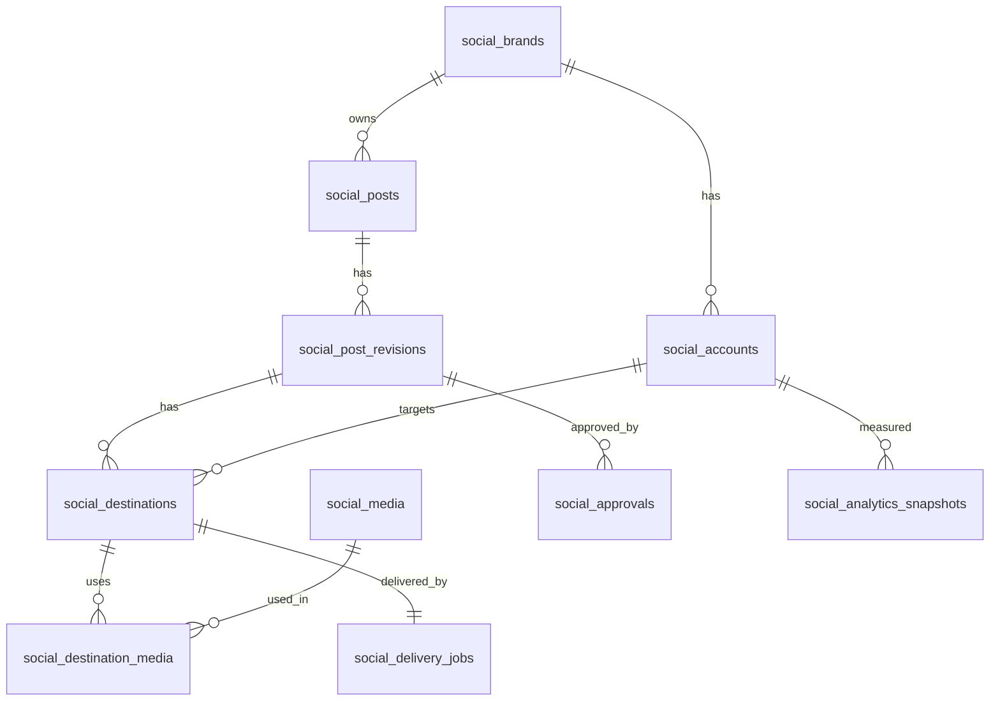

# social-infra

Infrastructure for cross-posting and automation behind `/admin/social` on thecrypto.support.

This repo holds everything that runs on the VPS: self-hosted Postiz, self-hosted n8n, and a small publishing worker. The admin UI, the database schema and the approval rules live in the site repo (Vercel + Supabase).

Status: proposal, implementation in progress. Nothing here publishes anything until an admin approves it.

Product requirements and the work split: [docs/PRD.md](docs/PRD.md). Where this README and the PRD differ, the PRD wins until this README is updated.

## How it fits together



Rules that never change:

1. n8n can only create drafts and report workflow results. It cannot approve or publish.
2. Supabase owns the schedule. n8n keeps no second schedule.
3. Only the worker holds a Postiz API key.
4. Postiz holds platform credentials. The site never sees them.
5. Approval is tied to the exact content, media, accounts and time. Any edit invalidates it.

## Repo layout

```
social-infra/
  docker-compose.yml
  .env.example
  Caddyfile
  n8n/
    workflows/            exported JSON, credential placeholders only
  worker/
    src/
    Dockerfile
  scripts/
    backup.sh
    restore.sh
  docs/
    setup.md              VPS, DNS, developer apps, callback URLs
    runbook.md            restore, reconnect accounts, upgrades
    schema.md             copy of the data model for reference
  .github/workflows/
    lint.yml
  README.md
```

## Services

| Service | Purpose | Notes |
| --- | --- | --- |
| Postiz | Platform connections, publishing, analytics | Pin the image version. Recent versions need Temporal |
| PostgreSQL + Redis | Postiz data and job queue | Not exposed publicly |
| Temporal | Workflow engine required by recent Postiz | Its own database |
| n8n | Automations that create drafts | Separate database and credentials |
| Worker | Claims approved jobs, submits to Postiz | Talks to the site over HTTPS |
| Caddy | HTTPS and reverse proxy | Two subdomains |

Domains (example, adjust to yours):

- `social.thecrypto.support` for Postiz
- `n8n.thecrypto.support` for n8n

Starting size: 4 vCPU, 8 GB RAM, persistent storage, EU region. Watch usage before upsizing.

## Quick start

```bash
git clone git@github.com:<org>/social-infra.git
cd social-infra
cp .env.example .env        # fill in values, never commit .env
docker compose pull
docker compose up -d
docker compose ps
```

Before the first start:

1. Point the two subdomains at the VPS with A records.
2. Fill `.env` (see below).
3. Open the Postiz URL, create the first user, then set registration to closed.

## Environment

Only placeholders live in git. Real values stay on the VPS.

```
# Postiz (see the Postiz configuration reference for the full list)
POSTIZ_URL=https://social.thecrypto.support
POSTIZ_JWT_SECRET=
POSTIZ_DB_PASSWORD=
# platform developer app credentials, added per platform as they are approved
LINKEDIN_CLIENT_ID=
LINKEDIN_CLIENT_SECRET=
FACEBOOK_APP_ID=
FACEBOOK_APP_SECRET=

# n8n
N8N_HOST=n8n.thecrypto.support
N8N_ENCRYPTION_KEY=
N8N_DB_PASSWORD=
N8N_AUTOMATION_TOKEN=        # scoped token for the site's automation API

# Worker
SITE_BASE_URL=https://thecrypto.support
WORKER_TOKEN=                # worker-only token for the site
POSTIZ_API_KEY=              # held by the worker only
```

## Publishing flow

1. n8n creates a draft through `/api/automation/social/v1/*`.
2. An admin edits and approves it in `/admin/social`. Approval stores a hash of the exact content.
3. Approval creates one delivery job per destination, in the same transaction.
4. The worker claims due jobs, checks the approval hash, and submits to Postiz.
5. The worker reports the Postiz ID, the result and the published URL per destination.

Failure handling:

- Definite transient failure: retry with backoff.
- Timeout or unknown result: mark `reconciling` and check Postiz before doing anything else. Never recreate a post that may exist.
- One platform failing never rolls back the others.
- Times are stored in UTC and shown in Europe/Bucharest.

## n8n workflows

| Workflow | What it does |
| --- | --- |
| Article to drafts | New blog article creates editable drafts with the canonical link |
| Campaign to draft | Admin-configured templates and calendars create drafts |
| Results to notifications | Failures and reconnect-needed alerts reach the admin |
| Analytics refresh | Daily metrics pull, weekly internal summary |

Conventions:

- Workflows change through pull requests, exported to `n8n/workflows/`. No editing in the UI on production.
- Authenticated webhooks, an event ID on every run, idempotent draft creation.
- Plain HTTP Request nodes against our own endpoints. The community Postiz node is not used for publishing, because it would hand n8n a key that bypasses approval.
- AI generation is off until the team decides otherwise.

## Platform coverage

| Platform | Mode at start |
| --- | --- |
| LinkedIn (company page) | Automatic after developer app approval |
| Facebook (page) | Automatic after developer app approval |
| Instagram | Automatic, needs a business or creator account linked to the Facebook page |
| X | Manual handoff, API is paid |
| TikTok | Manual handoff unless an eligible integration is approved |
| Others | Enabled only after verifying account type, permissions, free API access and formats |

Every account shows one of: connected, reconnect required, developer setup required, approval pending, manual publishing.

## Data model

The schema lives in the site repo as a Supabase migration (`0001_social_schema.sql`). Overview:

| Table | Purpose |
| --- | --- |
| `social_brands` | Brands, for example The Crypto Support, Comets of Web3 |
| `social_accounts` | Connected accounts, identified by provider account ID, many per platform |
| `social_media` | Uploaded images and videos, alt text, thumbnails |
| `social_posts` | A post and its overall status |
| `social_post_revisions` | Every edit creates a new revision |
| `social_destinations` | Per-account version of a revision: text, settings, time |
| `social_destination_media` | Ordered media per destination |
| `social_approvals` | Approval bound to a revision and a content hash |
| `social_delivery_jobs` | One job per destination, with lease, retries and Postiz result |
| `social_analytics_snapshots` | Metrics per account or destination, with an unavailable flag |
| `social_automation_runs` | n8n runs, unique per workflow and event ID |



Data rules:

- Row Level Security is on for every social table with no policies. Only server code using the service role can touch them. Browsers never write.
- A unique index on `social_delivery_jobs.destination_id` blocks duplicate submissions.
- Jobs are claimed with `for update skip locked` and a lease.
- An expired lease on a job that may already have reached Postiz goes to `reconciling`, not back to the queue.

## Security

- Admin-only endpoints use the existing admin auth, MFA and activity logging. No admin actions while impersonating a user.
- No Supabase service-role key, approval permission or Postiz key is ever given to n8n.
- Any new encrypted database secret uses the repo's `encrypt()` helper and joins its rotation procedure.
- `.env` never enters git. Pin container versions, no `latest`.

## Backups and restore

- Daily dumps of the Postiz, Temporal and n8n databases, plus volumes, through `scripts/backup.sh`.
- `scripts/restore.sh` and `docs/runbook.md` describe a full restore.
- Do one test restore on a clean machine before connecting real accounts.

## Implementation phases

- [ ] 0. Local sandbox: run Postiz, create an API key, create a post through the API, check the real rate limit
- [ ] 1. VPS, DNS, compose stack, HTTPS, backups with one test restore
- [ ] 2. Developer apps and callback URLs, first real connection (LinkedIn, Facebook, then Instagram)
- [ ] 3. Site foundation: migration, Postiz adapter, admin-only test endpoint, feature flag
- [ ] 4. First full flow: draft, approve, schedule, publish, retrieve URL
- [ ] 5. n8n workflows, in the order listed above
- [ ] 6. Analytics, then enable remaining accounts one at a time

## Acceptance checks

- Non-admins, sessions without MFA and n8n credentials cannot approve or publish.
- Editing approved content invalidates the approval.
- Concurrent workers, repeated events and restarts create no duplicates.
- Ambiguous results require reconciliation.
- Expired connections and partial failures stay visible and recoverable.
- Large video uploads avoid Vercel payload limits.
- Scheduling survives Bucharest daylight-saving changes.
- Paid-only platforms never trigger automatic API charges.
- Every connected destination has a successful controlled test post. Manual destinations have a full handoff.
- Backups restore the services and their connections.

## Out of scope

Comments, inboxes, advertising and paid AI.

## Notes

- Postiz is AGPL-3.0. Running it unmodified behind its API is fine. Talk to the team before modifying it.
- Platform API rules are separate from Postiz. Check each platform's current terms before enabling it.
