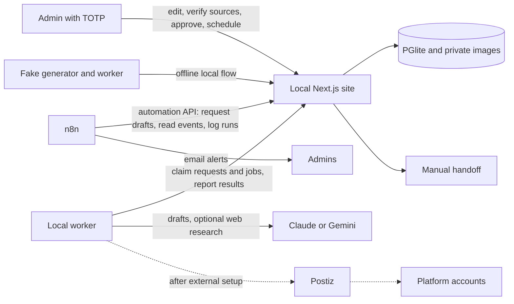
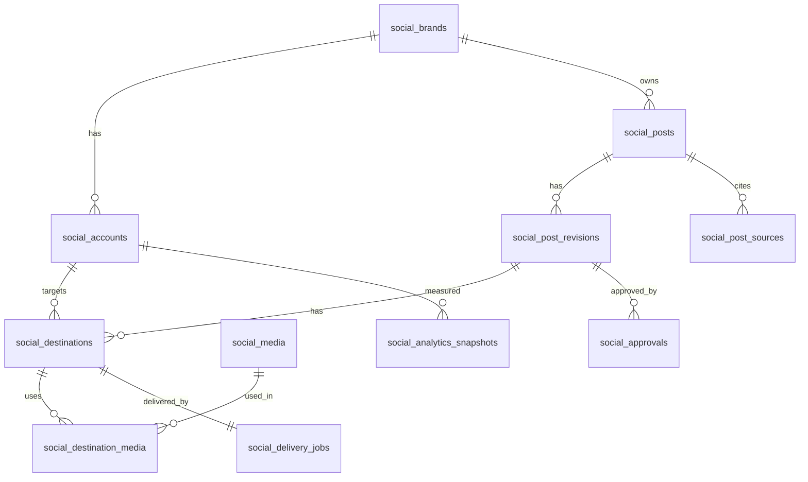

# social-infra

Infrastructure for cross-posting and automation behind `/admin/social` on thecrypto.support.

This repo contains the admin site, database migrations, approval rules, the AI drafting and publishing worker, n8n workflows, the local Postiz stack and infrastructure scripts. The site currently runs with local PGlite and TOTP login; Vercel, Supabase and VPS setup are documented for later deployment.

Status: local v1 implemented and tested, plus 44 platforms, brand style packs, opt-in web research with human-verified sources, and local n8n automations. External platform connections and VPS deployment remain pending. Publishing always requires admin approval.

Product requirements and the work split: [docs/PRD.md](docs/PRD.md), changed by amendments [01](docs/amendment-01-localhost-mvp.md) to [07](docs/amendment-07-n8n-news-sources.md). Where this README and the PRD differ, the PRD wins until this README is updated.

Current phase: **local v1 complete on `main`**, with amendment 07 on 2026-10-10. [Amendment 03](docs/amendment-03-finish-the-site.md) defines the completed local scope; external setup follows later.

## Progress on main

| Workstream | Delivered | Status |
| --- | --- | --- |
| W1: approval and scheduling | Posts pages, Bucharest slots and daily caps, figures gate, approve/cancel/retry/reschedule, frozen approved revisions | Complete locally |
| W2: media and cards | Private disk storage, signed uploads/downloads, EXIF/GPS stripping, media library, card studio and previews; all 54 format/template/brand combinations | Complete locally |
| W3: accounts and operations | Synced/manual accounts, brand assignment, modes/caps/pause, overview/events, DST calendar, manual handoffs and duplicate | Complete locally |
| W4: worker and generator | Claude/Gemini structured output, content validation and repair, generation lease heartbeats, media checksum verification and dry-run delivery | Complete locally |
| Amendments 04–05: platforms | Every Postiz provider (36 identifiers) plus nine manual channels: 44 platforms | Complete locally; channels not connected yet |
| Amendment 06: style packs | Public style rules and brand profiles, private per-brand packs with examples | Complete locally |
| Bug-fix batch (2026-10-10) | Migration `0011` state machine fixes, one Claude call per attempt, safer delivery reconcile, login lockout and session revocation | Complete locally |
| Amendment 07: news, sources, n8n | Opt-in web research, sources a person verifies before approval, the owner's original prompts as private briefs, automation API and four n8n workflows | Complete locally; untested against live web search and a running n8n |

Final review fixed approval checks for the actual attached card, immutable card metadata (migration `0007`), competing media/text edits, and consistent keyword matching. All four branches were merged into `main`; the feature branches remain available.

**Verified:** `bash scripts/update.sh --no-pull` passed with 276 site tests and 27 worker tests (at amendment 03; after amendment 05: `npm run ci` 361 site tests and 65 worker tests, both green), type checks, lint, migrations and a production build. HTTP smoke checks covered 16 authenticated pages, login redirects, both DST weeks, card previews and signed image downloads. The combined flow uses a fresh local database: fake generation → edit/card → approval → media download → published URL in overview/calendar, plus manual publication and the production worker in dry run. No real AI or platform API calls were used for acceptance. After amendment 04 (every Postiz provider, 35 platforms): `npm run ci` in `site` with 341 tests and a production build, and 63 worker tests. After the 2026-10-10 bug-fix batch (migration `0011`, 44 platforms): `npm run ci` in `site` with 409 tests and a production build, and 124 worker tests with the worker type check. After amendment 07 (migration `0012`): `npm run ci` in `site` with 476 tests and a production build, and 168 worker tests with the worker type check, all with fake AI clients (no real search or AI call).

**Remaining:** real Postiz sandbox validation and platform connections/developer approvals; Supabase/Vercel staging and VPS setup; controlled real posts and a restore drill. n8n runs locally with the automation API and email alerts ([amendment 07](docs/amendment-07-n8n-news-sources.md)); analytics refresh is deferred. See [Running the app](#running-the-app) below, [site/README.md](site/README.md) for the full local flow, and [the completed handoff](docs/handoff-codex.md) for validation details.

## How it fits together



Rules that never change:

1. Automation (n8n) can only create draft requests, read events and log its runs. It cannot approve or publish.
2. The site database owns the schedule: PGlite locally, Supabase after migration. Postiz and automation keep no second schedule.
3. Only the worker holds a Postiz API key.
4. Postiz holds platform credentials. The site never sees them.
5. Approval is tied to the exact content, media, accounts and time. Any edit invalidates it.

## Repo layout

```
social-infra/
  package.json              root workspace (worker)
  local/
    docker-compose.yml       Postiz v2.25.0 + Postgres + Redis + Temporal
    .env.example
  site/                     Next.js admin, local database, media, worker API and automation API
    supabase/migrations/     the authoritative schema (0001-0012)
  worker/
    src/
      loops/                 delivery, generator, sync
      services/              site-api, postiz-api, claude-api, gemini-api, llm
      generator/             prompts, research (web search), style-pack, schema, validators, repair
      delivery/              hash (+ hash.test), the publish/poll/reconcile
                             handlers live in loops/delivery.ts
      utils/                 health
    test/
      mock-site.mjs          stands in for Track A's site (PRD task B9)
    .env.example
  prompts/
    facts.yaml, banned.txt, system.md, social.md
    style/                   public rules: universal, content types (incl. news), research, self-check, platforms
    brands/                  public brand profiles and news topics
    private.example/         template for a private style pack
    private/                 git-ignored: per-brand packs, examples and the owner's original briefs
  posts_framework/          git-ignored: the owner's archive of posts and original prompts
  scripts/
    dev-local.sh, update.sh, n8n-local.sh, dev-up.mjs, dev-down.mjs, health-check.mjs, backup-local.mjs
  n8n/
    workflows/               news, articles, email alerts, campaign preset (placeholders only)
  card-templates/
    index.html               static brand-card design reference (not rendered by the worker)
  supabase/
    migrations/0001_social_schema.sql   reference copy; Track A owns the real one
  docs/
    PRD.md, amendment-01 ... amendment-07, setup.md, postiz-notes.md, visibility-channels.md
    contracts/               worker-api and automation-api OpenAPI files, hash-vectors.json
  README.md
```

The VPS phase (Caddy, two subdomains, n8n, `.github/workflows/`) comes later — see "Moving to a server later" in the amendment.

## Services

| Service | Purpose | Notes |
| --- | --- | --- |
| Postiz | Platform connections, publishing, analytics | Pin the image version. Recent versions need Temporal |
| PostgreSQL + Redis | Postiz data and job queue | Not exposed publicly |
| Temporal | Workflow engine required by recent Postiz | Its own database |
| n8n | Scheduled draft requests and email alerts through the automation API | Runs locally in WSL now (`scripts/n8n-local.sh`); its own data folder and credentials |
| Worker | Writes drafts with Claude or Gemini (optional web research), claims approved jobs, submits to Postiz | Holds the AI and Postiz keys; talks to the site over HTTP(S) |
| Caddy | HTTPS and reverse proxy | Two subdomains |

Domains (example, adjust to yours):

- `social.thecrypto.support` for Postiz
- `n8n.thecrypto.support` for n8n

Starting size (VPS phase): 4 vCPU, 8 GB RAM, persistent storage, EU region. Watch usage before upsizing.

## Running the app

Everything runs in **WSL (Linux)**. The Windows folder `R:\Repos\Agent_social` and the WSL folder `/mnt/r/Repos/Agent_social` are the same checkout. Run npm and Node only in WSL: an install from Windows writes Windows binaries that break the app in WSL.

### What you need

- WSL with Node 22.6 or newer (`nvm install 22 && nvm alias default 22`).
- An authenticator app (TOTP) for the admin login.
- Optional: a Claude (`ANTHROPIC_API_KEY`) or Gemini (`GEMINI_API_KEY`) key for real drafts. Without one, the fake generator writes test drafts.
- Optional: Docker, only for the Postiz stack (real publishing, not set up yet).
- Optional: an SMTP account for the n8n email alerts.

### First-time setup

From the repo root, in WSL (use your own email):

```bash
cd /mnt/r/Repos/Agent_social
bash scripts/update.sh --no-pull --admin-email you@example.com
cd site && npm run admin:create -- --email you@example.com && cd ..
```

- `update.sh` installs the dependencies and creates `site/.env.local` and `worker/.env` with fresh secrets and a matching `WORKER_TOKEN`. It puts your email in `ADMIN_EMAILS`, adds an `N8N_AUTOMATION_TOKEN` for n8n, creates the local database and runs all checks. It never overwrites an existing value.
- `admin:create` prints a password once. Keep it; the authenticator is set up at the first login.
- For real drafts, add `ANTHROPIC_API_KEY` or `GEMINI_API_KEY` to `worker/.env`. That file is git-ignored; never commit keys.

### Start and stop

```bash
bash scripts/dev-local.sh              # site + worker
bash scripts/dev-local.sh --site-only  # site only (for the fake generator and fake worker)
```

From Windows PowerShell: `wsl.exe -e bash /mnt/r/Repos/Agent_social/scripts/dev-local.sh`.

- **Before starting**, the script checks Node, the env files, `node_modules` and the ports. It prints whether publishing is off (`SOCIAL_PUBLISHING_ENABLED`, `WORKER_DRY_RUN`).
- **While running**, it prefixes each log line with `[site]` or `[worker]`.
- **Stopping**: **Ctrl+C** stops both. If the site or the worker exits on its own, the script stops the other one and exits with an error.
- **After editing `.env` files**: `site/.env.local` and `worker/.env` are read at start, so restart the app after changing them.
- **Database updates**: new database migrations apply automatically when the site starts.

The worker logs a few `TimeoutError` lines right after start while Next.js compiles the pages. They stop by themselves.

Optionally, start n8n in a second WSL terminal with `bash scripts/n8n-local.sh` (http://127.0.0.1:5678). See [n8n workflows](#n8n-workflows) for the one-time setup.

### Sign in

Open **http://localhost:3000/login** and enter your email and the password from `admin:create`.

- **Authenticator**: the first time, add the key shown on the page to your authenticator app, then type the 6-digit code. After that, every login asks for a code.
- **Allowed emails**: the email must be in `ADMIN_EMAILS` in `site/.env.local` (comma-separated). Add one with `bash scripts/update.sh --no-pull --admin-email other@example.com`, then restart.
- **Lockout**: 10 wrong passwords or codes lock the account for 15 minutes.
- **Sessions**: signing out ends all of that account's sessions. Signing in on another browser ends the earlier one.
- **Forgotten password or lost phone**: stop the app, then run `cd site && npm run admin:create -- --email you@example.com --reset`. You get a new password and the authenticator is removed, so you set it up again. Drafts and media stay.

### Using it

The admin pages:
- **Prezentare**: the overview, with what needs attention and the event feed.
- **Genereaza**: request AI drafts for a brand and platforms.
- **Ciorne**: edit drafts, cards and images.
- **Postari**: schedule, check figures, approve.
- **Calendar**: see what is scheduled.
- **Conturi**: assign accounts to brands, pause them, create manual accounts.
- **Media**: the image library.
- **Manual**: copy-and-paste handoffs for platforms without an API.

Locally, keep publishing off: `SOCIAL_PUBLISHING_ENABLED=false` in `site/.env.local` and `WORKER_DRY_RUN=true` in `worker/.env`.

**Without an AI key** (offline test flow):
1. Start the site with `bash scripts/dev-local.sh --site-only`.
2. In another WSL terminal, from `site/`, run `npm run social:fake-worker -- --sync`.
3. In **Conturi**, assign the fake accounts to a brand and unpause them.
4. Request drafts in **Genereaza**, then run `npm run social:fake-generator -- --once`.

The [site guide](site/README.md#run-locally-without-docker) continues through editing, media, figures, approval and publication. Don't run the fake generator while the real worker runs with an AI key: both claim the same requests.

### Recent news and verified sources

[Amendment 07](docs/amendment-07-n8n-news-sources.md) adds web research before writing.

- **Asking for it.** In **Genereaza**, pick **Stiri recente (cautare pe web)**, with an optional focus and a window in days (default 7). For a **Subiect**, tick **Cauta pe web date actuale**.
- **The research call.** The worker first searches the web: Claude web search, or Gemini Google Search. It writes research notes in which every fact carries a numbered source, then the normal writing call turns them into drafts.
  - Drafts cite sources only by number, and the worker maps each number back to a page the search actually returned, so the AI cannot invent links.
  - If the search finds nothing, or no story passes the quality check, the request fails with the reason and no writing call is made.
- **Verifying.** Every draft shows a **Surse** panel: title, outlet, date and what each link supports.
  - Tick **Verificat** on each link after you check it. Approval is blocked until every source is ticked, and the sources lock after approval.
  - **Copiaza sursele** copies the list for a LinkedIn first comment.
  - Figures that came from the web stay unverified, with a "sursa" link, until you confirm them.
- **The original Claude prompts.** The owner's original prompts (LinkedIn for Comets of Web3, Instagram for Taxes Support) live as private brief files in `prompts/private/<brand>/original/` and steer the voice, story choice and structure. The public, name-free rules are in `prompts/style/content-types.md` (News) and `prompts/style/research.md`.

### AI drafts and cost

- **One request at a time.** The worker handles one request at a time, in order. Each click on **Genereaza** is a separate paid request, so click once and wait.
- **Calls per request.** A request costs one AI call. It costs one more, a "repair" pass, only when a draft breaks a rule. Claude calls are not retried automatically; a Gemini 5xx is retried twice.
- **Web research.** It adds one research call and at most `RESEARCH_MAX_SEARCHES` searches (default 5) to a request. Claude charges $10 per 1,000 searches plus the tokens of the pages read. Gemini has no hard search cap; the limit is only asked for in the prompt. Requests without research don't search.
- **Exactly one call.** Set `GENERATION_REPAIR=false` in `worker/.env`; drafts that break a rule then show their errors in the editor. `CLAUDE_SERVER_FALLBACK=false` stops Anthropic from answering with another model when the chosen one is overloaded.
- **Choosing the model.** Pick it per request in the **Model AI** dropdown. "AI implicit" uses `GENERATOR_MODEL` and prefers Claude when its key is set, unless `GENERATOR_PROVIDER` says otherwise.
- **Writing style.** It comes from `prompts/style/`, `prompts/brands/` and the optional private pack in `prompts/private/` ([amendment 06](docs/amendment-06-style-packs.md)).

### Updating

Stop the app first; `update.sh` refuses to reinstall while the site or worker runs.

```bash
bash scripts/update.sh           # git pull, install, settings, database, all checks
bash scripts/update.sh --quick   # the same without the production build
```

### Scripts

From the repo root, in WSL:

| Command | What it does |
| --- | --- |
| `bash scripts/dev-local.sh [--site-only]` | Starts the site (http://localhost:3000) and the worker (health on :8787); Ctrl+C stops both |
| `bash scripts/update.sh [--no-pull] [--quick] [--admin-email EMAIL]` | Pull, install when needed, create missing settings, migrate, run every check. `--help` lists the options |
| `node scripts/backup-local.mjs` | Copies `site/.local-db/` (data and private images) and dumps the Postiz database to `~/agent-social-backups/<time>/`. Stop the app first; it refuses while the database is in use |
| `node scripts/health-check.mjs` | Checks that the site and the worker answer (Postiz optional); exits with an error when one is down |
| `node scripts/dev-up.mjs` / `node scripts/dev-down.mjs` | Start or stop the local Postiz stack in Docker (http://localhost:4007) |
| `bash scripts/n8n-local.sh [--import]` | Runs n8n in WSL without Docker (http://127.0.0.1:5678; the first run downloads it). `--import` loads the workflows from `n8n/workflows/` and exits |

In `site/` (`npm run <name>`):

| Command | What it does |
| --- | --- |
| `dev` / `build` / `start` | Development server, production build, production server (all on 127.0.0.1:3000) |
| `ci` | Type check, lint, all tests and a production build; `typecheck`, `lint` and `test` run one step |
| `admin:create -- --email EMAIL [--password '...'] [--reset]` | Create an admin, or reset one's password and authenticator. App stopped |
| `db:status` / `db:migrate` | Show or apply database migrations. App stopped |
| `db:reset -- --yes` | **Deletes the whole local database**: every draft, account and admin |
| `social:fake-worker -- --sync` | Registers fake channels. Other options in [site/README.md](site/README.md): `--once`, `--scenario`, `--race` |
| `social:fake-generator -- --once` | Answers one generation request with test drafts (`--fail` reports a failure) |

In `worker/`: `npm run dev` (the worker alone, restarts on code changes), `npm test`, `npx --no-install tsc --noEmit`.

### Troubleshooting

- **"port 3000 is in use"**: the app is already running in another terminal. Stop it there with Ctrl+C.
- **Login refused**: the email is missing from `ADMIN_EMAILS`, or the account is locked for 15 minutes after 10 failures.
- **"database in use"** from `admin:create` or `db:*`: stop the app first, because only one process can open the local database.
- **Gemini 503 "high demand"**: pick another model in the dropdown or try again later.
- **No drafts appear**: the worker needs an AI key in `worker/.env` (or use the fake generator) and a restart after adding it.

### Postiz sandbox (external setup still pending)

`node scripts/dev-up.mjs` starts the local Postiz/Temporal stack on http://localhost:4007. Before testing real delivery:
1. Create its user and an API key.
2. Configure `worker/.env`.
3. Close registration.
4. Connect a throwaway account.

[docs/setup.md](docs/setup.md) and [docs/postiz-notes.md](docs/postiz-notes.md) track the remaining setup and API checks.

## Environment

Only placeholders live in git (`.env` is git-ignored everywhere). Real values stay on each developer's or the publisher machine.

- [local/.env.example](local/.env.example) — Postiz JWT secret, registration toggle, provider credentials as each platform is connected.
- [site/.env.example](site/.env.example) — database mode, admin allowlist, local auth/media signing secrets, worker token, n8n automation token and the publishing kill switch.
- [worker/.env.example](worker/.env.example) — site URL/token, Postiz key, optional Claude/Gemini keys, generation provider/model/effort, repair and fallback switches, web research limits (`RESEARCH_MAX_SEARCHES`), heartbeat and loop intervals, dry-run setting. Keep AI keys blank for offline use.
- Generator style: public rules in `prompts/style/` and `prompts/brands/`; an optional private pack in `prompts/private/` (git-ignored, `STYLE_PACK_DIR`), template in `prompts/private.example/`: [amendment 06](docs/amendment-06-style-packs.md).

In the VPS phase these move to Vercel/VPS env and gain `N8N_AUTOMATION_TOKEN`, `N8N_ENCRYPTION_KEY`, a real `POSTIZ_URL` domain, and n8n's own env — see the amendment, section 11.

## Publishing flow

1. An admin requests drafts in **Genereaza**, or n8n creates the request through the automation API. The fake generator or the production generator, with optional web research, delivers them through the worker API.
2. An admin edits and approves it in `/admin/social`. Approval stores a hash of the exact content.
3. Approval creates one delivery job per destination, in the same transaction.
4. The worker claims due automatic jobs, checks the approval hash and media bytes, and either reports a dry-run result or submits to Postiz when real delivery is configured. Manual jobs become due for handoff.
5. The worker reports the Postiz ID, the result and the published URL per destination.

Failure handling:

- Definite transient failure: retry with backoff.
- Timeout or unknown result: mark `reconciling` and check Postiz before doing anything else. Never recreate a post that may exist.
- One platform failing never rolls back the others.
- Times are stored in UTC and shown in Europe/Bucharest.

## n8n workflows

n8n runs locally next to the site and talks only to the site's automation API (`/api/automation/social/v1`, token `N8N_AUTOMATION_TOKEN`). It can create generation requests, read events and log runs; it can never approve or publish. Setup: [n8n/README.md](n8n/README.md). The last runs show in the **Automatizari** card on **Prezentare**.

| Workflow (`n8n/workflows/`) | Trigger | What it does |
| --- | --- | --- |
| `news-to-drafts` | Mon, Wed, Fri 07:00 | One news request with web research per brand |
| `article-to-drafts` | RSS poll of the blog | A new article creates drafts with its link |
| `events-to-email` | Every 5 minutes | Emails a digest of alerts: failed posts, drafts ready, reconnects, manual posts due |
| `campaign-presets` | May, off by default | Declaratia Unica countdown drafts |

The workflows are imported switched off. Each scheduled news run costs, per brand, 2 AI calls and up to 5 searches. Analytics refresh is still deferred.

Quick start:
1. `bash scripts/update.sh --no-pull`, which creates `N8N_AUTOMATION_TOKEN`.
2. `bash scripts/n8n-local.sh --import`, then `bash scripts/n8n-local.sh`.
3. In n8n, create the "Agent Social automation" (Header Auth) and "Agent Social SMTP" credentials.
4. Edit each workflow's Config node, then activate the workflows.

Conventions:

- Workflows change through pull requests, exported to `n8n/workflows/`. No editing in the UI on production.
- Authenticated webhooks, an event ID on every run, idempotent draft creation.
- Plain HTTP Request nodes against our own endpoints. The community Postiz node is not used for publishing, because it would hand n8n a key that bypasses approval.
- AI generation creates drafts only; a person approves. The offline flow uses the fake generator.

## Platform coverage

| Platform | Target mode after setup |
| --- | --- |
| dev.to, Hashnode, X, Facebook, Instagram | Automatic when the channel and permissions are configured; X needs a billing cap |
| LinkedIn (company page and personal profile) | Manual until developer approval, then automatic |
| Threads, Bluesky, Mastodon, Reddit, Pinterest, Telegram, Discord, Medium, Farcaster, Nostr, Lemmy | Automatic through Postiz once the channel is connected ([amendment 04](docs/amendment-04-more-platforms.md)); most need a developer app or platform approval first (check each platform's current terms), and an account can wait in manual mode meanwhile |
| Slack, WordPress, Listmonk, VK, Google Business, Tumblr, Dribbble, MeWe, Skool, Whop, Moltbook, Kick, Twitch, TikTok (photo posts) | Automatic through Postiz once the channel is connected (amendment 04, second batch) |
| Substack, Product Hunt, YouTube | Manual handoff (YouTube needs video, which is uploaded by hand) |
| Quora, LinkedIn (articol), TradingView, Investing.com, Indie Hackers, Stack Exchange, GitHub, Forum, Presa (comunicat) | Manual handoff, always ([amendment 05](docs/amendment-05-manual-channels.md); forum and press accounts are one per forum or outlet, created by hand; the per-site research is in [visibility-channels](docs/visibility-channels.md)) |

Forty-four platforms in all: every provider of the pinned Postiz `v2.25.0` (36 identifiers, of which four are aliases) plus Substack, Product Hunt and the nine manual channels of amendment 05. Some need a field the generator cannot know (a subreddit, a Pinterest board, a Discord or Slack channel, a Lemmy community, a Listmonk list): a person fills it in the composer, and approval waits for it. Limits and sources are in the [PRD platform tables](docs/PRD.md#5-scope-brands-accounts-platforms); server variables per provider are in [setup.md](docs/setup.md).

Images are supported in local v1; video is outside its scope, so TikTok gets photo posts and YouTube a manual handoff. Real platform connections and controlled posts remain pending; [PRD section 5](docs/PRD.md#5-scope-brands-accounts-platforms) owns the platform requirements.

Every account shows one of: connected, reconnect required, developer setup required, approval pending, manual publishing.

## Data model

The authoritative schema is in `site/supabase/migrations/`, applied to PGlite locally and to Supabase when that environment is configured. Overview:

| Table | Purpose |
| --- | --- |
| `social_brands` | Brands: Taxes Support, Comets of Web3, The Crypto Support (legacy) |
| `social_accounts` | Connected accounts, identified by provider account ID, many per platform |
| `social_media` | Uploaded/generated images, immutable bytes/hash/card metadata, suggested alt text |
| `social_posts` | A post and its overall status |
| `social_post_revisions` | Every edit creates a new revision |
| `social_destinations` | Per-account version of a revision: text, settings, time |
| `social_destination_media` | Ordered media per destination |
| `social_approvals` | Approval bound to a revision and a content hash |
| `social_delivery_jobs` | One job per destination, with lease, retries and Postiz result |
| `social_analytics_snapshots` | Metrics per account or destination, with an unavailable flag |
| `social_generation_requests` | Generation inputs, lease, outcome and draft counts |
| `social_publish_attempts` | Submission/reconciliation history for each job |
| `social_events` | Outbox and in-app event feed |
| `social_workers` | Worker heartbeat and account-sync health |
| `social_upload_tickets` | Durable one-use upload phases and expiry |
| `social_post_sources` | Web sources of a post, each ticked as verified by a person; frozen after approval |
| `social_automation_runs` | n8n run log, unique per workflow and event ID |



Data rules:

- Row Level Security is on for every social table with no policies. Only server code using the service role can touch them. Browsers never write.
- A unique index on `social_delivery_jobs.destination_id` blocks duplicate submissions.
- Jobs are claimed with `for update skip locked` and a lease.
- An expired lease on a job that may already have reached Postiz goes to `reconciling`, not back to the queue.
- Approval refuses a post while any of its sources is unverified, and while any web figure is unconfirmed.

## Security

- Admin-only endpoints use the existing admin auth, MFA and activity logging. No admin actions while impersonating a user. Locally: 10 failed passwords or codes lock an account for 15 minutes, each authenticator code works once, and sign-out ends every session of that account.
- No Supabase service-role key, approval permission or Postiz key is ever given to n8n. Its `N8N_AUTOMATION_TOKEN` (32+ characters, constant-time check) only opens draft requests, the event feed and the run log.
- AI and Postiz keys live only in `worker/.env`.
- Real names, handles and posts stay in the git-ignored `posts_framework/` and `prompts/private/`. The repository is public.
- Platform credentials stay in Postiz; the site stores no platform passwords.
- `.env` never enters git. Pin container versions, no `latest`.

## Backups and restore

`node scripts/backup-local.mjs` (run it in WSL with the site and worker stopped) copies `site/.local-db/` (site data and private images) and dumps the local Postiz database into `~/agent-social-backups/<timestamp>/`; it refuses while the site holds the database and exits non-zero when a part fails. Automated VPS backups and a clean-machine restore drill remain pending before real accounts are enabled.

## Implementation phases

- [x] 0a. Worker delivery/generator/sync loops, Claude/Gemini structured output, generation heartbeats, canonical hash vectors, safe dry run and offline HTTP acceptance
- [ ] 0b. Local sandbox: run Postiz for real, create an API key, create a post through the API, check the real rate limit (task B3, `docs/postiz-notes.md`)
- [ ] 1. VPS, DNS, compose stack, HTTPS, backups with one test restore (deferred — localhost MVP first, see the amendment)
- [ ] 2. Developer apps and callback URLs, first real connection (dev.to/Hashnode first, then LinkedIn, Facebook, Instagram)
- [x] 3. Local site foundation: migrations, authenticated admin, worker API and publishing feature flag
- [x] 4. Local full flow: draft, media, approve, schedule, fake/dry-run publication and URL, plus manual handoff
- [x] 5. n8n workflows: news, articles, email alerts and a campaign preset through the automation API ([amendment 07](docs/amendment-07-n8n-news-sources.md)); analytics refresh still deferred
- [ ] 6. Analytics, then enable remaining accounts one at a time

## Acceptance checks

These remain the production criteria. Local validation is recorded under **Progress on main**; real posts, external integration and restore verification are still pending.

- Non-admins, sessions without MFA and n8n credentials cannot approve or publish.
- Editing approved content invalidates the approval.
- Every researched source is verified by a person before approval; drafts cite only pages the search returned.
- Concurrent workers, repeated events and restarts create no duplicates.
- Ambiguous results require reconciliation.
- Expired connections and partial failures stay visible and recoverable.
- Image uploads strip metadata; signed downloads and checksums preserve the approved media.
- Scheduling survives Bucharest daylight-saving changes.
- Paid-only platforms never trigger automatic API charges.
- Every connected destination has a successful controlled test post. Manual destinations have a full handoff.
- Backups restore the services and their connections.

## Out of scope

Comments, inboxes, advertising, video and analytics dashboards are outside the current local scope.

## Notes

- Postiz is AGPL-3.0. Running it unmodified behind its API is fine. Talk to the team before modifying it.
- Platform API rules are separate from Postiz. Check each platform's current terms before enabling it.
