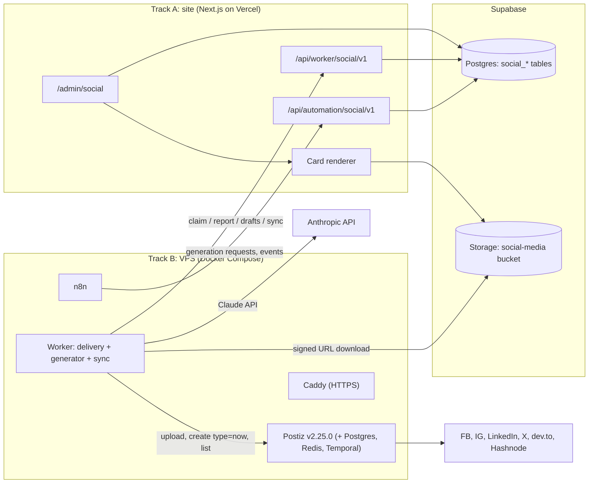

# PRD: Social publishing for Taxes Support

| | |
| --- | --- |
| Status | Local v1 complete on main; offline acceptance passed; external setup and go-live pending |
| Last updated | 2026-10-07 |
| Tracks | **A: Site** (proposed owner: Raul) · **B: Infra, worker, generator** (proposed owner: Ale) |
| Related | [README](../README.md) (infra overview; this PRD wins where they differ) |
| Amendments | [01: Localhost MVP](amendment-01-localhost-mvp.md) (no VPS, everything on localhost) · [02: Standalone site](amendment-02-standalone-site.md) · [03: Finishing the site locally](amendment-03-finish-the-site.md) (local mode and W1–W4 implemented) · [04: More platforms](amendment-04-more-platforms.md) (every Postiz provider: 35 platforms, Pinterest and Dribbble card formats) |

> This repository is **public**. Never commit secrets, real `.env` files, account handles that are not public, or internal notes from the site repository.

---

## 1. Summary

An admin opens `/admin/social`, requests a batch of posts (from a blog article or a topic), edits them, checks every number, approves, and schedules. The implemented local app runs in this repository with PGlite, private disk media and TOTP login. Fake generation/delivery and the production worker in dry run complete the flow without external services. Substack and Product Hunt have a ready-to-paste manual handoff.

After external setup, the production worker will submit approved posts to self-hosted Postiz for automatic platforms and return their public URLs. VPS deployment, Supabase staging, platform connections and controlled real posts remain pending.

```
generate (AI) → edit → approve (exact content) → schedule → worker submits when due → Postiz → platform → URL back in /admin
```

The original two-track plan remains below. Amendments 01–03 define the current local scope; W1–W4 were completed concurrently, reviewed and merged into `main`. The production milestone dates in section 12 are the original plan, not a record of deployment.

### Progress as of 2026-10-06

| Workstream | Completed locally |
| --- | --- |
| W1 | Approval/scheduling pages and actions; suggested slots, figures gate, daily caps, cancel/retry/reschedule, immutable approved revisions |
| W2 | Private storage, one-use upload tickets, metadata stripping, signed image downloads, library, card studio and destination previews; all 54 card combinations |
| W3 | Accounts controls, worker health, overview/events, DST calendar, manual Substack/Product Hunt handoff, publication confirmation and duplicate |
| W4 | Claude/Gemini structured output, validation/repair and figure provenance, generation heartbeats, lease-loss handling, media checksums and safe dry-run delivery |

Acceptance passed in WSL: **276 site tests and 27 worker tests**, type checks, lint, migration application and the production build. Production HTTP smoke covered 16 authenticated pages, login redirects, both DST weeks, manual handoffs, card previews and signed downloads. Cross-stream acceptance used fresh local data and real HTTP to verify fake generation → edit/card → figures check and approval → downloaded media → published URL in overview/calendar, manual publication, and the production worker's dry run. Real AI and platform APIs were not called for acceptance.

Final review added migration `0007_media_metadata_immutable.sql`, checked the copy/figures on each attached immutable card, prevented competing text/media edits, and aligned keyword validation. See [completed handoff](handoff-codex.md) and [site setup](../site/README.md). The local milestone is complete; live publishing and production go-live are still pending.

Amendment 04 (2026-10-07) added every Postiz provider: twelve platforms first, then fifteen more (35 in all), all automatic through Postiz except YouTube (video only, manual-only), and the Pinterest and Dribbble card formats (migrations `0008_more_platforms.sql` and `0009_all_postiz_platforms.sql`): see section 5 and [amendment 04](amendment-04-more-platforms.md). No platform connection exists yet.

## 2. Goals, non-goals, success

### Goals

1. One place to produce, approve and schedule posts for all our brands and accounts.
2. AI does the first draft in bulk; a person always approves, and every number is checked by a person before it goes out.
3. Branded images are generated automatically in the site's look (Light / Dark / Mint templates), with uploads still possible.
4. Publishing is safe by construction: nothing goes out without approval of the exact content, nothing is posted twice, and a failure on one platform never blocks the others.
5. Low volume, low cost: **at most 5 posts per account per day.**

### Non-goals for v1

- Comments, inboxes, DMs, advertising.
- Video (YouTube uploads, TikTok and Instagram video, Reels). Images only in v1: TikTok gets photo posts, and YouTube a manual handoff where the video is uploaded by hand (amendment 04).
- Analytics dashboards (phase 2; the data model leaves room).
- Connecting accounts from inside `/admin`. In v1 accounts are connected in the Postiz UI by the Track B owner and synced into `/admin` automatically.
- Multi-tenant SaaS, billing, or anything for non-staff users.
- Browser automation, scraping or stored passwords for any platform.

### Success metrics (first 60 days after go-live)

| Metric | Target |
| --- | --- |
| Duplicate posts | 0 |
| Posts published with an unchecked figure | 0 |
| Posts published without an approval | 0 |
| Approved posts published within 5 minutes of their slot | ≥ 98% |
| Time from "generate 10 drafts" to "10 drafts approved and scheduled" | < 30 minutes |
| Accounts in `reconnect_required` noticed by the team | within 24 h (notification) |

## 3. Decisions already made

| # | Decision | Source |
| --- | --- | --- |
| D1 | Self-hosted **Postiz, pinned to `v2.25.0`** (released 2026-10-02) does platform auth and publishing. Upgrades are deliberate PRs. | README, research report |
| D2 | **PGlite locally**, then a dedicated **Supabase Postgres** project, stores everything we own. Postiz keeps a separate Postgres. | Amendments 02 and 03 |
| D3 | **The site database owns the schedule.** The worker submits to Postiz only when a post is due, using Postiz `type: "now"`. Postiz never holds a future-dated post of ours. | Resolves the "two schedules" problem |
| D4 | **AI drafts, human approves.** The generator never approves or publishes. | Raul, 2026-10-04 (replaces "AI off" in the README) |
| D5 | **Images: generated brand cards + uploads.** Video is out of v1. | Raul, 2026-10-04 |
| D6 | **v1 platforms:** Facebook Page, Instagram, LinkedIn company page, X, Hashnode, dev.to (automatic through Postiz); Substack, Product Hunt (manual handoff). | Raul, 2026-10-04 |
| D7 | **X is automatic** with X's pay-per-use billing; the 5/day cap keeps it small. A monthly spend cap is set in the X developer console. | Raul, 2026-10-04 (replaces "X manual" in the README) |
| D8 | **Daily cap: max 5 posts per account per Bucharest calendar day**, enforced by the site. | Raul, 2026-10-04 |
| D9 | Only the worker holds the Postiz API key. n8n can create generation requests and read events, nothing else. | README rules 1–4 |
| D10 | Approval binds the exact text, settings, media, account and time. Any edit creates a new revision that needs a new approval. | README rule 5 |
| D11 | Existing admins may approve their own drafts (no four-eyes rule) unless the team changes this (Q5). | Earlier proposal |
| D12 | Times are stored in UTC and shown in `Europe/Bucharest`. | README |

## 4. Users and roles

| Role | Who | Can |
| --- | --- | --- |
| Admin | Existing site admins with MFA | Everything in `/admin/social`: generate, edit, approve, schedule, cancel, retry, manage accounts |
| Ops | Track B owner (+1 backup) | Postiz UI login (connect/reconnect accounts only), VPS, n8n |
| Worker | Service on the VPS | Claim due jobs and generation requests, report results, sync accounts (`WORKER_TOKEN`) |
| n8n | Service on the VPS | Create generation requests, read the event feed, log runs (`N8N_AUTOMATION_TOKEN`) |

Rules: admin actions need the existing admin auth with MFA, are written to the existing activity log, and are refused while impersonating a user. **Nobody composes or publishes posts in the Postiz UI.** The worker flags any Postiz post that has no matching job (`foreign_post` event).

## 5. Scope: brands, accounts, platforms

### Brands

Seed three brands: **Taxes Support** (umbrella, taxes.support), **The Crypto Support** (thecrypto.support), **Comets of Web3**. Brands are rows, so more can be added. Which accounts exist per brand is an open question (Q2); Track B fills the inventory in `docs/setup.md`.

### Platforms in v1

| Platform | Mode | Content type | Postiz provider | Setup blocker (Track B, start day 1) | Platform rules to enforce |
| --- | --- | --- | --- | --- | --- |
| Facebook Page | auto | social | `facebook` | Meta app; business verification of the company; Page admin connects. Check first whether Development mode with app roles is enough for an internal tool before filing App Review. | Image optional, link allowed |
| Instagram (Professional) | auto | social | `instagram-standalone` (Instagram Login, no Page link needed) or `instagram` (via Facebook) | Same Meta app; account must be Business or Creator | **≥ 1 image required**, caption ≤ 2,200 chars, ≤ 30 hashtags, no URLs in caption (not clickable), aspect 4:5 to 1.91:1 |
| LinkedIn company page | auto once approved, **manual until then** | social | `linkedin-page` | LinkedIn app + Community Management API application (needs the registered company) | ≤ 3,000 chars |
| X | auto | social | `x` | Developer account, project/app, pay-per-use billing, spend cap | ≤ 280 weighted chars (URL = 23), ≤ 4 images |
| dev.to | auto | article | `devto` | API key from the account settings | Title, markdown body, ≤ 4 tags, `canonical` = our blog URL, cover 1000×420 |
| Hashnode | auto | article | `hashnode` | Personal access token + publication | Title, subtitle, markdown, tags, `canonical` = our blog URL, cover 1600×840 |
| Substack | **manual** | article | none (no official publishing API) | Publication URL only | Copy-ready title, subtitle, body (HTML + markdown), cover |
| Product Hunt | **manual** | launch | none (its API cannot create launches; B2 confirms) | Maker account | Launch kit: name, tagline ≤ 60, description ≤ 260, maker comment, gallery 1270×760. One-off launches, not daily posts (Q4). |

The Postiz provider list was checked against the `v2.25.0` source on 2026-10-04: it includes `x`, `facebook`, `instagram`, `instagram.standalone`, `linkedin.page`, `dev.to` and `hashnode` (dev.to and Hashnode support a `canonical` setting); it has no Substack or Product Hunt provider. Exact provider identifiers and limits are re-checked in task B3 against Postiz's `GET /integrations/{id}/settings`, which returns each channel's max length and settings schema.

### Platforms added by amendment 04

Twelve platforms, all with a Postiz provider in the pinned `v2.25.0` source, so all are **automatic**; none is manual-only. Any account can still be switched to manual mode (a channel waiting for a platform's approval), and then the manual handoff of 6.2 applies with the fields below. Decisions and the platforms left out: [amendment 04](amendment-04-more-platforms.md). Limits come from the sources named in the last column (checked 2026-10-07); "flagged" means the source could not be re-read that day and the value is the commonly documented one.

| Platform | Kind | Postiz provider | Text limit | Images | Required fields, tags, titles | Sources |
| --- | --- | --- | --- | --- | --- | --- |
| Threads | social | `threads` | ≤ 500 characters | ≤ 20 (carousel) | One topic tag per post: a second hashtag only warns | Postiz `threads.provider.ts` (`maxLength` 500, error "Post text exceeds 500 characters limit"). Meta Threads API docs for the carousel size and the topic tag (flagged: the docs need a browser) |
| Bluesky | social | `bluesky` | ≤ 300 **graphemes** and ≤ 3,000 UTF-8 bytes | ≤ 4, with alt text | No limit on hashtags in the text | atproto lexicons `app.bsky.feed.post` (`maxGraphemes` 300, `maxLength` 3000) and `app.bsky.embed.images` (`maxLength` 4); Postiz `bluesky.provider.ts` (300, "maximum 4 pictures") |
| Mastodon | social | `mastodon` (`mastodon-custom` for an instance of your choice) | ≤ 500 characters, **every link counts 23** | ≤ 4; alt text ≤ 1,500 | none | Mastodon docs, `Instance` entity: `statuses.max_characters` 500, `max_media_attachments` 4, `characters_reserved_per_url` 23, `media_attachments.description_limit` 1500 (defaults; an instance may differ); Postiz `mastodon.provider.ts` (500) |
| LinkedIn (profile) | social | `linkedin` | ≤ 3,000 | ≤ 9 | none (the page is `linkedin-page`, a separate platform) | Postiz `linkedin.provider.ts` (`maxLength` 3000). Image count carried over from `linkedin-page` (flagged) |
| Reddit | social | `reddit` | body ≤ 10,000 | a media post holds exactly 1 | **subreddit**, **title ≤ 300**, post type `self` / `link` / `media`, link URL for `link`, optional flair id | Postiz `reddit.provider.ts` (`maxLength` 10000, `checkValidity`: one media file) and `reddit.dto.ts`; Reddit's published source, `VTitle` (`max_length = 300`). Reddit allows longer bodies; Postiz's lower limit is the one that is enforced |
| Pinterest | social | `pinterest` | description ≤ 500; alt text ≤ 500 | **at least 1**, ≤ 5; 1000×1500 recommended | **board (numeric id)**, **title ≤ 100**, **link ≤ 2,048 characters** | Postiz `pinterest.provider.ts` (`maxLength` 500, "Requires at least one media", "up to 5 media items") and `pinterest.dto.ts` (title 100, numeric board id); Pinterest API v5, create pin: title 100, description 800, link 2048, alt text 500 |
| Telegram | social | `telegram` | ≤ 4,096; **≤ 1,024 when an image is attached** (it becomes the caption) | ≤ 10 (one media group) | none (the chat is the Postiz channel's bot) | Postiz `telegram.provider.ts` (`maxLength` 4096; one image is sent with the text as caption); Telegram Bot API: `sendMessage` text 1–4096, caption 0–1024, `sendMediaGroup` 2–10 items |
| Discord | social | `discord` | ≤ 1,980 | ≤ 10 (flagged) | **channel (numeric id)** | Postiz `discord.provider.ts` (`maxLength` 1980) and `discord.dto.ts`; Discord API reference, Create Message: content up to 2,000 characters |
| Medium | **article** | `medium` | body ≤ 100,000 | the API takes no cover; images go in the markdown | **title**, **subtitle** (Postiz requires it), tags ≤ 3 of ≤ 25 characters, canonical URL to our blog | Postiz `medium.provider.ts` and `medium.settings.dto.ts` (title, subtitle, canonical, ≤ 4 tags); Medium API docs: "only the first three" tags, tags over 25 characters ignored, `canonicalUrl`, the title is metadata only |
| Farcaster | social | `wrapcast` | ≤ 320 **UTF-8 bytes** | ≤ 2 embeds | channel optional | Farcaster protocol specification (`CastAddBody`: `CAST` ≤ 320 bytes, `LONG_CAST` ≤ 1,024 bytes, ≤ 2 embeds); Postiz `farcaster.provider.ts` (`maxLength` 800; needs Neynar credentials on the Postiz server) |
| Nostr | social | `nostr` | ≤ 100,000 | no documented limit (Postiz appends image links to the note) | none | NIP-01 sets no content limit (relays do); Postiz `nostr.provider.ts` (`maxLength` 100000) |
| Lemmy | social | `lemmy` | body ≤ 10,000 | ≤ 1 (the post thumbnail) | **community name**, **community id (numeric)**, **title 3–200 on one line**, optional link ≤ 2,000 | Postiz `lemmy.provider.ts` (`maxLength` 10000, one picture) and `lemmy.dto.ts`; Lemmy `validation.rs` (title 3–200, post body 50,000, URL 2,000, alt text 1,500) |

Counting is platform-specific, like X's weighted length: Bluesky counts graphemes, Mastodon counts a link as 23, Farcaster counts bytes, every other platform counts code points (`site/src/lib/social/text-length.ts`, copied to the worker).

#### Second batch: every other Postiz provider

The owner then asked for support of every Postiz provider. The pinned `v2.25.0` already contains all 36 provider files (identifiers listed in [amendment 04](amendment-04-more-platforms.md)), so no Postiz upgrade is needed. Four identifiers are aliases, not platforms: `instagram-standalone` is Instagram, `mastodon-custom` is Mastodon, `tiktok-business` is TikTok and `wrapcast` is Farcaster. Fifteen more platforms are added; **YouTube is manual-only** because its Postiz provider accepts exactly one video and nothing else (`checkValidity`: "Item must be a video"), and this app makes text and images. A YouTube channel still syncs and shows in the accounts screen (always as a manual account), the generator drafts its title and description, and the handoff page says "needs video"; no video upload is built. **TikTok is automatic**: its provider publishes photo posts (several images, no video).

| Platform | Kind | Postiz provider | Text limit | Images | Required fields, tags, titles | Sources |
| --- | --- | --- | --- | --- | --- | --- |
| Slack | social | `slack` | ≤ 40,000 | images only, no video | **channel (id)** | Postiz `slack.provider.ts` (`maxLength` 400000, "No video support for Slack, only images"), `slack.dto.ts`; Slack API `chat.postMessage`: Slack truncates above 40,000 characters (advises 4,000), which is the limit enforced |
| WordPress | **article** | `wordpress` | body ≤ 100,000, sent as HTML | 1 featured image | **title** (≥ 2), post type (default `post`), status (default `publish`) | Postiz `wordpress.provider.ts` (`maxLength` 100000, HTML editor), `wordpress.dto.ts` (title, type, status `publish`/`draft`/`pending`/`private`, `main_image`; category and tag ids are numeric and not set here). The worker turns the markdown body into the tags Postiz keeps for HTML editors (`p`, `h1`–`h3`, `ul`, `li`, `strong`, `a`) |
| Listmonk | **article** (newsletter) | `listmonk` | none that matters (Postiz 100,000,000), sent as HTML | none | **subject** (the title), preview line (the subtitle), **list (numeric id)**, optional template id | Postiz `listmonk.provider.ts`, `listmonk.dto.ts` |
| VK | social | `vk` | ≤ 2,048 | uploaded to the wall post | none | Postiz `vk.provider.ts` (`maxLength` 2048) |
| Google Business | social | `gmb` | ≤ 1,500 | ≤ 1 (4:3, the `dribbble` card format) | optional button (`cta_type`) and its link; the post is a standard post (event and offer fields are not exposed) | Postiz `gmb.provider.ts` (`maxLength` 1500; "can only have one image", no video), `gmb.settings.dto.ts` |
| Tumblr | social | `tumblr` | ≤ 32,768 | ≤ 30 | optional title (≤ 4,096), link, source URL, tags (one string, ≤ 4,096) | Postiz `tumblr.provider.ts` (`maxLength` 32768, "up to 30 images"), `tumblr.dto.ts` |
| Dribbble | social | `dribbble` | description ≤ 40,000 | **exactly 1, 400×300 or 800×600** | **title**, optional team link; new `dribbble` card format 800×600 | Postiz `dribbble.provider.ts` (`maxLength` 40000, "Requires one item", the two sizes, no mp4), `dribbble.dto.ts`; Dribbble API v2 (shots are 400×300 / 800×600) |
| MeWe | social | `mewe` | ≤ 63,206 | images (video skipped) | post to profile or to a **group (id)** | Postiz `mewe.provider.ts` (`maxLength` 63206), `mewe.dto.ts` |
| Skool | social | `skool` | ≤ 5,000 | passed to the provider, no cap | **group**, **category (label id)**, **title** | Postiz `skool.provider.ts` (`maxLength` 5000), `skool.dto.ts` |
| Whop | social (forum post) | `whop` | ≤ 50,000 (markdown) | passed to the provider, no cap | **company (id)**, **forum (experience id)**, optional title | Postiz `whop.provider.ts` (`maxLength` 50000), `whop.dto.ts` |
| Moltbook | social | `moltbook` | ≤ 300 | text only | optional submolt (Postiz posts to `general` without one) | Postiz `moltbook.provider.ts` (`maxLength` 300; the title is the first 100 characters) |
| Kick | social (live chat message) | `kick` | ≤ 500 | text only | none | Postiz `kick.provider.ts` (`maxLength` 500, "Kick chat doesn't support media attachments") |
| Twitch | social (live chat message or announcement) | `twitch` | ≤ 500 | text only | optional message type and announcement colour | Postiz `twitch.provider.ts` (`maxLength` 500), `twitch.dto.ts` |
| TikTok | social (photo post) | `tiktok` (`tiktok-business`) | description ≤ 2,000 | **at least 1**, ≤ 35, **shorter side ≤ 1,080 px**; PNG is converted to JPEG by Postiz | title ≤ 90, visibility (default **private**, `SELF_ONLY`, because unaudited apps can only post privately); duet, stitch, music and the like are fixed off | Postiz `tiktok.provider.ts` (`maxLength` 2000, `convertToJPEG`, `checkValidity`), `tiktok.dto.ts`; TikTok Content Posting API, photo post (title 90, description 4,000, up to 35 images) |
| YouTube | social (video) | `youtube` | description ≤ 5,000 | thumbnail only | **title (≤ 100)**, tags (≤ 500 characters in all, a tag with a space counts two more) | Postiz `youtube.provider.ts` (`maxLength` 5000, "Item must be a video"), `youtube.settings.dto.ts`. **Manual-only: needs video** |

Postiz needs server variables per provider (OAuth apps, bots); they are listed in [setup.md](setup.md). Every platform of the first batch and this one has the same fields in the composer, the preview and the manual handoff. Platform count: 20 + 15 = 35 (Substack and Product Hunt have no Postiz provider; 33 platforms come from the 36 identifiers).

### Daily cap

- Default and maximum: 5 posts per account per Bucharest calendar day. An admin can lower it per account.
- Counted: destinations that are approved and scheduled that day, plus ones already published that day. Manual destinations count too.
- Enforced when approving and when rescheduling (clear error naming the account and day), and again at claim time.

## 6. User flows

### 6.1 Generate → approve → publish (main flow)

1. Admin opens **Generate**, picks a brand, a source (blog article URL, or a topic with hooks such as "deadline 25 mai"), the platforms and how many posts (1–20).
2. The site stores a generation request. The worker claims it, calls Claude, validates the output, and posts drafts back. The admin sees them in **Drafts** within about a minute.
3. Each draft has a canonical text, one variant per platform, a brand card spec (rendered by the site into images in the right sizes), and a list of the figures it uses.
4. Admin edits in the **Composer**: per-destination tabs, live validation, preview with the generated card, swap template, upload a different image.
5. Admin picks the time (the site suggests the next free slot under the cap) and clicks **Approve**. If any destination contains figures, the admin must tick "Am verificat cifrele" (I checked the numbers). MFA session required.
6. Approval creates one delivery job per destination in the same transaction.
7. At the slot time the worker claims the job, re-verifies the content hash, transfers the media to Postiz, and submits with `type: "now"`.
8. The worker polls Postiz until the post is published or failed, and reports the public URL or the error.
9. **Overview** shows each destination's state; a failed destination can be retried alone.

### 6.2 Manual handoff (Substack, Product Hunt, YouTube, LinkedIn before approval, any account switched to manual mode)

1. Same generate/edit/approve flow. At the slot time the job becomes `manual_pending` and a notification goes out.
2. The destination page shows: copy buttons (plain, markdown, HTML), image downloads, an "Open editor" link to the platform, and a checklist (for Product Hunt).
3. The admin publishes by hand and clicks **Mark as published**, pasting the URL. The job becomes `manual_done`.

### 6.3 Reconnect

1. The worker's account sync sees that Postiz needs a refresh for a channel, so the site sets the account to `reconnect_required` and emits an event; n8n notifies the team.
2. Scheduled jobs for that account stay queued and do not fail until their stale window passes.
3. Ops reconnects in the Postiz UI; the next sync sets the account back to `connected`.

### 6.4 Failure and retry

- Retryable errors (rate limits, 5xx, network) retry automatically: 1 min, 5 min, 15 min, maximum 3 attempts.
- Auth or permission errors mark the account and fail the job without retrying.
- A result that may or may not have reached Postiz goes to `reconciling` (section 10.3), never straight back to the queue.
- A job that cannot be published within **2 hours** of its slot is failed as `STALE` (a "deadline today" post must not go out three days late). The admin can reschedule, which needs a new approval.

## 7. Functional requirements

Each requirement lists its track. "Must" is required for go-live; "Should" can slip to just after.

### F1. Accounts (A, with sync from B)

- Must: list accounts synced from Postiz (platform, name, picture, Postiz integration ID, status, last sync). Unassigned accounts appear in an "Assign to brand" queue.
- Must: per account: brand, mode (`auto` / `manual`), daily cap (1–5), paused flag, status badge (connected, reconnect required, developer setup required, approval pending, manual).
- Must: create manual-only accounts (Substack, Product Hunt, any platform) with an "Open editor" URL.
- Must: show "worker last seen" and "last account sync" times; warn if older than 5 minutes / 30 minutes.

### F2. Generator (B: generation; A: request form and drafts inbox)

- Must: request form: brand, source (`article` URL from our blog, or `topic` + hooks), platforms, count 1–20, preferred card templates.
- Must: generator output passes the content rules (section 8) before it reaches the site. One automatic repair attempt with the validation errors; if still failing, the draft is delivered with `validation_errors` so a person can fix it.
- Must: every number, percentage, amount and date in a draft is listed in `figures`, each marked `source: article | facts | unverified`. Numbers may only come from the source article or `worker/prompts/facts.yaml` (maintained by people, with the fiscal year each fact applies to). Anything else is `unverified`, which blocks approval until edited or confirmed.
- Must: requests are idempotent; re-delivering drafts for the same request never creates duplicates.
- Must: Claude API with model `claude-opus-5-5` by default (env `GENERATOR_MODEL`), effort set explicitly (`medium`), structured output (`output_config.format` with a JSON Schema, via the SDK's `beta.messages.stream()` and `finalMessage()`), and the server-side refusal fallback (`fallbacks: "default"`, beta `server-side-fallback-2026-07-01`). Always check `stop_reason` before reading content.
- Must: Claude and Gemini share a strict output schema; provider/model selection is part of the generation request. A missing selected provider key fails that request clearly. Generation heartbeats keep the lease alive during generation and repair, and lease loss stops reporting.
- Should: n8n creates a generation request automatically when a new blog article appears (sitemap or RSS poll).
- Should: campaign presets (for example a "Declaratia Unica" countdown in May) as saved request inputs.

### F3. Brand cards and media (A)

- Must: render cards server-side from a card spec (section 10.5) with the site's tokens and Plus Jakarta Sans, in the formats each destination needs, as PNG into private storage: disk in local mode, Supabase Storage after migration.
- Must: templates Light, Dark and Mint exactly as in the brand palette (section 8.3). At most one gold element per card. White text on `#11A594` only at 24px+ bold.
- Must: uploads use a server-issued, short-lived ticket: the local upload route in local mode, or a direct signed Storage URL in Supabase mode (no file passes through a Vercel function). Images only in v1: JPEG/PNG/WebP, ≤ 8 MB, metadata (EXIF/GPS) stripped on ingest.
- Must: every image has alt text (generator suggests it; admin can edit).
- Must: compute and store `sha256`, MIME type, width, height, bytes.

### F4. Composer (A)

- Must: one canonical text plus one tab per destination, each editable, with character counters and the platform rules from section 5 and section 8 checked live.
- Must: preview per destination with its rendered card.
- Must: article kind has title, subtitle, markdown body, tags, canonical URL (defaults to the source article), cover card.
- Must: launch kind (Product Hunt) has name, tagline, description, maker comment, gallery.
- Must: saving an edit creates a new revision. Revisions are immutable once approved (database trigger).
- Should: "suggest slot" picks the next free time per account under the cap, using default slots (09:00, 13:00, 18:00 Bucharest, editable).

### F5. Approval (A)

- Must: approve a revision: requires MFA session, all destinations valid, a time on each destination, cap respected, and "figures checked" when any destination contains figures. Stores `approval_hash` (section 10.6).
- Must: approval and job creation happen in one database transaction.
- Must: cancel an approved destination that has not been submitted; cancel the whole post.
- Must: "Retry failed destinations only".
- Must: rescheduling or editing an approved post creates a new revision and needs a new approval; unsubmitted jobs of the old revision are cancelled in the same transaction.

### F6. Delivery (B: worker; A: claim/report API and state)

- Must: worker loop every 30 s: claim due jobs (≤ 5 at a time), verify hash, transfer media, submit, poll, reconcile, report. Section 10.3 defines the protocol.
- Must: `WORKER_DRY_RUN=true` verifies claimed hashes, downloads/checks media and reports test publication results without calling Postiz. It skips Postiz upload, sync, polling and reconciliation. AI generation is separate; keep AI keys blank and use fake generation for an offline run.
- Must: global kill switch on the site (`SOCIAL_PUBLISHING_ENABLED=false` makes claim return nothing) and a per-account pause.

### F7. Account sync (B)

- Must: every 15 minutes, read Postiz integrations and post them to `/accounts/sync`, including the per-channel rules (max length) and whether a refresh is needed.
- Must: detect Postiz posts in the last 24 h with no matching job and report a `foreign_post` event.

### F8. Manual handoff (A)

- Must: as in flow 6.2, with copy formats, downloads, open-editor link, checklist, mark as published with URL.

### F9. Notifications (B: n8n; A: event feed)

Local v1 implements the in-app event feed. External notifications and the automation API below are deferred by amendments 01 and 03.

- Must: the site writes events to an outbox; n8n polls `/events` and notifies the team for: `delivery_failed`, `delivery_stale`, `account_reconnect_required`, `manual_due`, `drafts_ready`, `generation_failed`, `foreign_post`, `worker_silent`.
- Channel: Q6 (email through the site's existing email setup, or a team Telegram chat).

### F10. Overview and calendar (A)

- Must: overview: approval queue, today's and upcoming posts, failures, reconnects, worker health.
- Must: calendar (week view, Bucharest time) with each destination's status and link to the public URL.
- Should: duplicate a post as a new draft.

## 8. Content rules (single source of truth)

Both tracks implement these: the generator (B) validates before delivering drafts; the site (A) validates again before approval and is authoritative.

### 8.1 Voice

- Romanian by default, using **tu**: direct, calm, plain words. Reassuring, not alarmist: explain, don't scare.
- No hype, no price predictions, no investment advice. This is a tax tool, not a trading tool.
- **No diacritics** (matches the site copy): reject `ă â î ș ş ț ţ` and their capitals.
- Brand names written exactly "Taxes Support" and "The Crypto Support". Domains appear only inside links, never in a sentence.
- The legal operator's company name never appears in a post.

### 8.2 Hard checks (block approval)

| Check | Rule |
| --- | --- |
| Diacritics | none allowed |
| Banned phrases | list kept in `worker/prompts/banned.txt` and mirrored in the site's config (a change goes to both): starts with "to the moon", "garantat", "profit sigur", "pretul va", "investeste acum" |
| Legal name | operator company name not present |
| Bare domain | `taxes.support` / `thecrypto.support` only as part of a URL |
| Length | per platform (section 5), counted the platform's way: X weighted, Bluesky graphemes (and 3,000 bytes), Mastodon links as 23, Farcaster bytes, Telegram 1,024 with an image |
| Instagram | at least one image, no URLs in caption |
| Required fields (amendment 04) | Reddit: subreddit and title (≤ 300), a `link` post needs a URL, a `media` post exactly one image. Pinterest: at least one image, numeric board id, title (≤ 100), link. Discord: channel id. Lemmy: community name, community id, title (3–200). Medium: title, subtitle. Farcaster: a channel, if given, is a valid channel id. Slack: channel id. WordPress, Listmonk: title (the subject); Listmonk also a list id. Dribbble: one 400×300 or 800×600 image and a title. TikTok: at least one image, none over 1,080 px on the short side. Skool: group, category, title. Whop: company, forum. MeWe: group when posting to a group. Google Business: a link for every button but "call". YouTube: title (≤ 100), tags (≤ 500 characters in all), and a warning that it needs video |
| Tags (amendment 04) | Medium at most 3 tags of at most 25 characters (dev.to 4, Hashnode 5, Instagram 30 hashtags as before); Threads warns past one hashtag |
| Figures | any digit, `%`, `lei`, `RON`, `EUR` or date triggers `contains_figures`; approval needs "figures checked"; any `unverified` figure blocks approval until resolved |
| Article canonical | dev.to, Hashnode and Medium posts must have `canonical` set to our blog URL |

### 8.3 Brand cards

Palette and templates (light mode tokens unless stated):

| Token | Hex | Use on cards |
| --- | --- | --- |
| `ink` | `#16313A` | Text on light; background of Dark template |
| `ink-soft` | `#5D7178` | Secondary lines, footer |
| `accent` | `#11A594` | Shapes, underline; text only at 24px+ bold |
| `accent-dark` | `#0C7F72` | Teal text, CTA on Mint |
| dark-mode `accent` | `#2DD4BE` | Keyword on the Dark template (7.4:1 on ink) |
| `accent-soft` | `#D6F0EA` | Chips, badges |
| `bg-soft` | `#F4FAF8` | Light template background (alt) |
| `bg-mint` | `#E7F5F0` | Mint template background |
| `gold` | `#E8A805` | The single number that matters ("16%", "25 mai"). Max one per card |

Templates: **Light** (white or `#F4FAF8`, ink headline, teal accent, ink-soft footer), **Dark** (`#16313A`, white headline, `#2DD4BE` keyword, gold stat), **Mint** (`#E7F5F0`, ink text, `#0C7F72` CTA). Typeface Plus Jakarta Sans 400/600/700/800. Card radius 22px where shapes are used. Logos: the brand's mark, bottom-left, with the brand name.

## 9. Architecture



| Component | Repo | Track |
| --- | --- | --- |
| Schema migration, RLS, Postgres functions | site repo | A |
| `/admin/social` UI, card renderer, media uploads | site repo | A |
| Worker API, automation API, event outbox | site repo | A |
| Fake worker and fake generator scripts (for A's testing) | site repo | A |
| Docker Compose, Caddy, backups, runbook | this repo | B |
| Worker (delivery, generator, account sync), prompts, facts | this repo `worker/` | B |
| n8n workflows (exported JSON) | this repo `n8n/workflows/` | B |
| Mock site API (for B's testing) | this repo `worker/test/` | B |
| Contracts: OpenAPI, JSON Schemas, hash test vectors | this repo `docs/contracts/` | joint |

## 10. Contracts

Everything in this section is frozen at milestone M0. After that, a change is a PR to `docs/contracts/` approved by both owners. API paths are versioned (`/v1`); breaking changes need `/v2`.

### 10.1 Data model (Supabase Postgres, owned by A)

Migration in the site repo, next free number. RLS on for every table, no policies: only server code with the service role touches them. Browsers never write.

| Table | Key columns |
| --- | --- |
| `social_brands` | `id`, `slug` unique, `name`, `logo_path` |
| `social_accounts` | `id`, `brand_id` (null until assigned), `platform`, `mode` (`auto`/`manual`), `status`, `postiz_integration_id` unique null, `display_name`, `picture_url`, `profile_url`, `open_editor_url`, `daily_cap` (1–5, default 5), `paused`, `rules` jsonb (from Postiz), `last_synced_at` |
| `social_media` | `id`, `kind` (`image`), `source` (`generated`/`upload`), `storage_path`, `mime`, `width`, `height`, `bytes`, `sha256`, `alt_text`, `card_spec` jsonb null, `format`, `created_by` |
| `social_generation_requests` | `id`, `brand_id`, `input` jsonb, `status`, `requested_by`, `workflow` + `event_id` (unique together, null for UI requests), `lease_owner`, `lease_expires_at`, `attempts`, `error_code`, `error_message`, `finished_at` |
| `social_posts` | `id`, `brand_id`, `kind` (`social`/`article`/`launch`), `title`, `source_url`, `generation_request_id`, `generation_ref` unique (request id + `client_ref`), `status`, `current_revision_id`, `created_by` |
| `social_post_revisions` | `id`, `post_id`, `number`, `canonical_text`, `body_markdown`, `created_by`, `created_at` |
| `social_destinations` | `id`, `revision_id`, `account_id`, `text`, `settings` jsonb, `scheduled_at` timestamptz, `scheduled_tz` (default `Europe/Bucharest`), `contains_figures`, `figures` jsonb, `validation` jsonb, `destination_hash` |
| `social_destination_media` | `destination_id`, `media_id`, `position` (pk: destination + position) |
| `social_approvals` | `id`, `revision_id` (one active per revision), `approved_by`, `approved_at`, `approval_hash`, `figures_checked`, `revoked_at`, `revoked_reason` |
| `social_delivery_jobs` | `id`, `destination_id` **unique**, `status`, `run_at`, `stale_after` (default 2 h), `attempts`, `lease_owner`, `lease_expires_at`, `postiz_post_id`, `postiz_group`, `remote_url`, `published_at`, `last_error_code`, `last_error_message`, `manual_done_by`, `manual_done_at` |
| `social_publish_attempts` | `id`, `job_id`, `attempt_no` (unique with job), `worker_id`, `started_at`, `submitting_at`, `finished_at`, `outcome`, `error_code`, `http_status`, `details` jsonb |
| `social_events` | `id` bigserial, `type`, `payload` jsonb, `created_at` (outbox for n8n) |
| `social_automation_runs` | `id`, `workflow`, `event_id` (unique together), `status`, `details` |
| `social_workers` | `worker_id`, `version`, `last_seen_at` |

Analytics tables come in phase 2.

### 10.2 State machines

**Account `status`:** `connected` · `reconnect_required` · `developer_setup_required` · `approval_pending` · `manual`.

**Generation request:** `queued` → `running` (claimed, leased 10 min) → `done` | `failed`. An expired lease goes back to `queued` (max 3 attempts, then `failed`).

**Post `status`** (derived from its destinations, stored for listing): `draft` → `approved` → `publishing` → `published` | `partial` | `failed`; or `cancelled`.

**Delivery job:**

| From | To | Trigger |
| --- | --- | --- |
| (none) | `queued` / `manual_pending` | approval (manual accounts go straight to `manual_pending` and notify at `run_at`) |
| `queued` | `claimed` | worker claim at/after `run_at` (lease 10 min, `attempts + 1`) |
| `queued` | `failed` (`STALE`) | claim after `run_at + stale_after` |
| `claimed` | `submitting` | worker calls `/submitting` right before the Postiz create call |
| `claimed` | `queued` | lease expired (Postiz was never called) |
| `submitting` | `submitted` | worker reports Postiz IDs |
| `submitting` | `reconciling` | lease expired, or the worker reports an unknown result |
| `submitted` | `published` / `failed` | worker poll of Postiz |
| `reconciling` | `submitted` / `published` | reconcile found the post in Postiz |
| `reconciling` | `queued` | reconcile confirmed it is not in Postiz (first time only) |
| `reconciling` | `failed` (`RECONCILE_MISS`) | not found a second time; a person decides |
| `failed` | `queued` | admin "Retry" (same approved content, new attempt) |
| `queued`, `claimed`, `manual_pending` | `cancelled` | admin cancel or new revision |
| `manual_pending` | `manual_done` | admin "Mark as published" with URL |

Retryable failures (section 10.7) go `failed → queued` automatically with backoff until 3 attempts.

### 10.3 Worker API (A implements, B consumes)

Base: `${SITE_BASE_URL}/api/worker/social/v1`. Headers: `Authorization: Bearer ${WORKER_TOKEN}`, `X-Worker-Id: <stable id>`, `X-Worker-Version`. JSON bodies. Every call updates `social_workers.last_seen_at`. `409` means the lease was lost: the worker must stop work on that job immediately.

| Method and path | Body → Response | Notes |
| --- | --- | --- |
| `POST /deliveries/claim` | `{limit≤5}` → `{jobs: DeliveryJob[]}` | Returns due `publish` jobs, `poll` jobs (submitted, waiting for result) and `reconcile` jobs, leased. Empty when the kill switch is off. Enforces cap and stale window. |
| `POST /deliveries/{id}/heartbeat` | `{attempt_no}` → `{lease_expires_at}` | Extends lease by 10 min |
| `POST /deliveries/{id}/submitting` | `{attempt_no}` → `200` / `409` | Must succeed before calling Postiz create |
| `POST /deliveries/{id}/submitted` | `{attempt_no, postiz_post_id, postiz_group}` | Idempotent |
| `POST /deliveries/{id}/result` | `{attempt_no, outcome, remote_url?, error_code?, error_message?, retry_after_seconds?}` | `outcome`: `published` · `failed` · `retry` · `reconciling` · `not_found` |
| `POST /generation/claim` | `{limit: 1}` → `{requests: [{request_id, brand, input, lease_expires_at}]}` | |
| `POST /generation/{id}/heartbeat` | `{}` → `{lease_expires_at}` | Owner-only extension by 10 min; unknown request 404, lost/expired lease 409 |
| `POST /generation/{id}/drafts` | `{drafts: Draft[]}` → `{created, skipped}` | Idempotent on `request_id + client_ref`; marks request `done` and emits `drafts_ready` |
| `POST /generation/{id}/failed` | `{error_code, error_message}` | |
| `POST /accounts/sync` | `{integrations: [{postiz_integration_id, provider, name, picture_url, profile_url, disabled, refresh_needed, rules}], postiz_recent_posts: [{postiz_post_id, integration_id, created_at}]}` | Upserts by integration id, updates status, emits `account_reconnect_required` and `foreign_post` |

`DeliveryJob`:

```json
{
  "job_id": "uuid",
  "kind": "publish",
  "attempt_no": 1,
  "lease_expires_at": "2026-11-02T08:10:00Z",
  "run_at": "2026-11-02T08:00:00Z",
  "account": { "id": "uuid", "platform": "linkedin-page", "postiz_integration_id": "abc123" },
  "destination": {
    "id": "uuid",
    "text": "Ai pana pe 25 mai sa depui Declaratia Unica...",
    "settings": {},
    "scheduled_at": "2026-11-02T08:00:00Z",
    "destination_hash": "hex sha256"
  },
  "media": [
    { "media_id": "uuid", "url": "signed Storage URL, 1 h TTL", "mime": "image/png", "sha256": "hex", "alt_text": "..." }
  ],
  "postiz": null,
  "attempt_started_at": null
}
```

For `poll` and `reconcile` jobs, `postiz` holds `{post_id, group}` when known and `attempt_started_at` is set.

**Worker procedure (B):**

1. **publish**: recompute `destination_hash` from the payload (section 10.6); on mismatch report `failed` with `HASH_MISMATCH`. Download each media URL, check `sha256`, upload to Postiz (multipart upload, or upload-from-url with `RESTRICT_UPLOAD_DOMAINS` set to the Supabase host). Call `/submitting`. Call Postiz create with `type: "now"`. On a response, report `/submitted`. On a timeout or connection drop after the request was sent, report `result: reconciling`.
2. **poll**: read the post from Postiz. Published, so report `published` with the release URL. Error, so classify (section 10.7). Still queued after 45 min, so report `reconciling`.
3. **reconcile**: list Postiz posts for that integration between `attempt_started_at − 5 min` and `+ 60 min`, match on normalized text. Found, so report `/submitted` (then poll). Not found and at least 15 min since the attempt, so report `not_found`.

### 10.4 Automation API (A implements, n8n in B consumes)

Deferred in local v1 by amendments 01 and 03. The following contract is the future integration target, not a live endpoint in the current app.

Base: `${SITE_BASE_URL}/api/automation/social/v1`. Header: `Authorization: Bearer ${N8N_AUTOMATION_TOKEN}`.

| Method and path | Body → Response | Notes |
| --- | --- | --- |
| `POST /generation-requests` | `{workflow, event_id, brand, input}` → `{request_id, created}` | Idempotent on `workflow + event_id` |
| `GET /events?after={id}&limit=100` | → `{events: [{id, type, created_at, payload}], next_after}` | n8n polls every 5 min and keeps the cursor |
| `POST /runs` | `{workflow, event_id, status, details}` | Logs automation runs for the Automations view |

n8n polls the site, so **n8n needs no public webhook** and its UI can stay behind an IP allowlist or VPN.

### 10.5 Draft and card spec (B produces, A consumes)

`platform` values used everywhere in the contracts: `facebook`, `instagram`, `linkedin-page`, `x`, `devto`, `hashnode`, `substack`, `producthunt`, and (amendment 04) `threads`, `bluesky`, `mastodon`, `linkedin` (a personal profile; `linkedin-page` is the company page), `reddit`, `pinterest`, `telegram`, `discord`, `medium`, `farcaster`, `nostr`, `lemmy`, and the second batch `slack`, `wordpress`, `listmonk`, `vk`, `gmb`, `tumblr`, `dribbble`, `mewe`, `skool`, `whop`, `moltbook`, `kick`, `twitch`, `tiktok`, `youtube` (35 in all). The worker maps them to Postiz provider identifiers (section 5; Farcaster is `wrapcast`; `instagram-standalone`, `mastodon-custom` and `tiktok-business` are aliases of `instagram`, `mastodon` and `tiktok`). `substack`, `producthunt` and `youtube` are manual-only.

Generation `input`:

```json
{
  "source": { "type": "article", "url": "https://thecrypto.support/ghid/..." },
  "platforms": ["facebook", "instagram", "linkedin-page", "x"],
  "kinds": ["social"],
  "count": 5,
  "language": "ro",
  "templates": ["dark", "light", "mint"]
}
```

`source` can also be `{ "type": "topic", "topic": "...", "hooks": ["deadline", "rate-change"] }`.

`Draft`:

```json
{
  "client_ref": "1",
  "kind": "social",
  "title": null,
  "canonical_text": "...",
  "source_url": "https://thecrypto.support/ghid/...",
  "variants": [
    { "platform": "x", "text": "...", "settings": {} },
    { "platform": "instagram", "text": "...", "settings": { "post_type": "post" } }
  ],
  "article": null,
  "card": {
    "template": "dark",
    "headline": "Impozitul pe castigurile crypto creste",
    "keyword": "creste",
    "stat": "16%",
    "subline": "Din anul fiscal 2026. Afla ce inseamna pentru tine.",
    "brand": "the-crypto-support",
    "alt_text": "..."
  },
  "figures": [
    { "value": "16%", "context": "impozit pe castig din anul fiscal 2026", "source": "facts" }
  ],
  "validation_errors": [],
  "notes": "Short note for the reviewer"
}
```

For `kind: "article"`, `article` is `{ "title", "subtitle", "body_markdown", "tags": [], "canonical_url" }` and `variants` holds the dev.to / Hashnode / Substack / Medium entries. For `kind: "launch"`, `article` is replaced by `launch: { "name", "tagline", "description", "maker_comment" }`.

Card spec limits: `headline` ≤ 70 chars, `keyword` a substring of `headline`, `stat` ≤ 8 chars and optional (it is the single gold element), `subline` ≤ 110 chars, `template` one of `light` / `dark` / `mint`.

Card formats the renderer (A) produces per destination:

| Format | Size | Used for |
| --- | --- | --- |
| `square` | 1080×1080 | Facebook, LinkedIn (page and profile), Threads, Lemmy |
| `portrait` | 1080×1350 | Instagram |
| `x` | 1600×900 | X, Bluesky, Mastodon, Reddit, Telegram, Discord, Farcaster, Nostr |
| `devto_cover` | 1000×420 | dev.to |
| `hashnode_cover` | 1600×840 | Hashnode, Substack, Medium |
| `ph_gallery` | 1270×760 | Product Hunt |
| `pinterest` | 1000×1500 | Pinterest (2:3 pins; amendment 04) |
| `dribbble` | 800×600 | Dribbble (shots must be 400×300 or 800×600), Google Business (4:3) |

Neutral `settings` per platform (B maps them to Postiz provider settings):

| Platform | Settings |
| --- | --- |
| `x` | `who_can_reply`: `everyone` (default) |
| `instagram` | `post_type`: `post` |
| `facebook`, `linkedin-page` | none in v1 |
| `devto`, `hashnode` | `title`, `subtitle` (Hashnode), `tags`, `canonical_url`, `cover_media_id` |
| `medium` | `title`, `subtitle`, `tags` (≤ 3), `canonical_url` |
| `reddit` | `subreddit`, `title`, `post_type` (`self`, `link`, `media`), `link_url`, `flair_id` |
| `pinterest` | `board` (numeric id), `title`, `link` |
| `discord`, `farcaster` | `channel` (a numeric id for Discord; optional for Farcaster) |
| `lemmy` | `community`, `community_id`, `title`, `link` |
| `slack` | `channel` (id) |
| `wordpress` | `title`, `post_type` (default `post`), `status` (default `publish`) |
| `listmonk` | `title` (the subject), `subtitle` (the preview line), `list` (id), `template` (id) |
| `gmb` | `cta_type`, `cta_url` |
| `tumblr` | `title`, `link`, `source_url`, `tags` |
| `dribbble` | `title`, `team` |
| `mewe` | `post_type` (`timeline` or `group`), `group` |
| `skool` | `group`, `label`, `title` |
| `whop` | `company`, `experience`, `title` |
| `moltbook` | `submolt` |
| `twitch` | `message_type`, `announcement_color` |
| `tiktok` | `title`, `privacy_level` (default `SELF_ONLY`) |
| `youtube` | `title`, `tags` (manual handoff only) |
| `linkedin`, `threads`, `bluesky`, `mastodon`, `telegram`, `nostr`, `vk`, `kick` | none |

The generator never invents `subreddit`, `board`, `channel`, `community` or `community_id`: a person fills them in the composer, and approval stays blocked until they are set. It does supply `title` (Reddit, Pinterest, Lemmy) and the Pinterest `link` (the source article).

### 10.6 Content hash

- `destination_hash = sha256_hex(JCS({ account_id, platform, text, settings, scheduled_at, media: [{ sha256, alt_text }...in position order] }))`, with `scheduled_at` as ISO 8601 UTC to the second, `Z` suffix.
- `approval_hash = sha256_hex(JCS({ post_id, revision_id, destinations: [destination_hash...sorted by destination id] }))`.
- JCS is RFC 8785 JSON canonicalization (use the `canonicalize` npm package on both sides).
- `docs/contracts/hash-vectors.json` holds at least five input/expected-hash pairs (including Romanian text, emoji, empty settings and multiple images). Both implementations run them in CI.

### 10.7 Error codes

| Code | Meaning | Retry | Side effect |
| --- | --- | --- | --- |
| `RATE_LIMITED` | 429 from Postiz or platform | yes, after `retry_after_seconds` | |
| `TRANSIENT` | 5xx, network, Postiz down | yes, 1 / 5 / 15 min | |
| `MEDIA_FETCH_FAILED` | signed URL expired or unreachable | once, with a fresh claim | |
| `AUTH_EXPIRED` | token invalid, refresh needed | no | account → `reconnect_required` |
| `PERMISSION_DENIED` | missing scope or role | no | account → `developer_setup_required` |
| `VALIDATION_REJECTED` | platform rejected the content | no | |
| `HASH_MISMATCH` | payload differs from what was approved | no | event, investigate |
| `UNKNOWN_RESULT` | request sent, no reliable answer | no | job → `reconciling` |
| `STALE` | slot + stale window passed | no | event `delivery_stale` |
| `RECONCILE_MISS` | second reconcile could not find the post | no | a person decides |

## 11. Workstreams

Each task retains its original completion criteria. The progress column records what is implemented and verified as of 2026-10-06; external staging, real providers and live publishing are listed separately from local completion.

### Track A: Site (proposed owner: Raul)

Works in `site/` in this repository, under `/admin/social` (read the repo's agent notes first; admin writes go through the server-side admin client; CSP nonces on scripts; verify with `npm run ci`).

| # | Task | Original completion criteria | Progress |
| --- | --- | --- | --- |
| A1 | Schema migration, RLS, immutability trigger for approved revisions, claim function (`for update skip locked`, leases, cap, stale window, kill switch), lease sweeper | Migration applied to staging; concurrent-claim test shows no double claims | Done on local PGlite; Supabase staging pending |
| A2 | Worker API and automation API (section 10.3, 10.4), token auth with constant-time compare, event outbox | OpenAPI contract tests pass; hash vectors pass | Worker API/outbox done; automation API deferred |
| A3 | Fake worker and fake generator scripts that drive the APIs with random outcomes (published, failed, reconciling, drafts with validation errors) | A can demo every UI state without Track B | Done; fixture scenarios and combined local flow tested |
| A4 | Accounts screen (F1) | Synced and manual accounts manageable; status badges; worker health | Done locally, including manual accounts and worker health |
| A5 | Generate form and drafts inbox (F2 site side) | Request created, drafts from fake generator appear | Done; fake generation and drafts editing tested |
| A6 | Card renderer and media library (F3) | All six formats render for all three templates and three brands; uploads go direct to Storage | Done locally; 54 renders and upload/download checks pass; real Storage pending |
| A7 | Composer and validation (F4, section 8) | Every hard check in 8.2 blocks approval with a clear message | Done; content, card/figure checks and frozen revisions tested |
| A8 | Approval, cancel, retry, reschedule (F5) | Acceptance checks 1–4 in section 14 pass | Done; checks 1–4 covered, including DST and cap regression tests |
| A9 | Overview, calendar, manual handoff (F8, F10) | Manual flow completes end to end with fake worker | Done; overview/calendar URLs and manual publication tested |

### Track B: Infra, worker, generator (proposed owner: Ale)

Works in this repo.

| # | Task | Original completion criteria | Progress |
| --- | --- | --- | --- |
| B1 | Repo hygiene: `.gitignore`, `.env.example` built from the Postiz configuration reference (real variable names such as `FRONTEND_URL`, `MAIN_URL`, `JWT_SECRET`, `REDIS_URL`, `DISABLE_REGISTRATION`, `STORAGE_PROVIDER`, `UPLOAD_DIRECTORY`, `API_LIMIT`, `RESTRICT_UPLOAD_DOMAINS` plus each provider's keys), README aligned with this PRD | No secret can be committed by accident; README and PRD agree | Local repo hygiene and current docs implemented |
| B2 | **Day 1:** account inventory and developer apps: Meta (business verification, app, Pages + Instagram), LinkedIn (app + Community Management API application), X (developer account, billing, spend cap), dev.to key, Hashnode token, Anthropic API key with a monthly limit. Callback URLs on the chosen domain (Q1). Status table in `docs/setup.md` | Every v1 account has a known state and owner; blockers have dates | Pending external account inventory, approvals and billing setup |
| B3 | Local Postiz `v2.25.0` sandbox: API key, upload, create `type: "now"` to a throwaway dev.to account, list posts, confirm which fields give publish state and release URL, confirm `API_LIMIT` behaviour. Findings in `docs/postiz-notes.md` | Notes answer every "verify" item in this PRD | Pending real Postiz sandbox validation |
| B4 | VPS stack: Compose (Postiz, Postgres, Redis, Temporal, n8n, worker, Caddy), pinned images, HTTPS, Postiz uploads reachable over HTTPS (platforms fetch media), registration closed, n8n UI restricted, daily backups, one test restore on a clean machine | Restore drill documented in `docs/runbook.md` | Deferred; no VPS deployment or restore drill |
| B5 | Worker delivery (F6, section 10.3): claim loop, hash check, media transfer, submit, poll, reconcile, error classification, dry-run, JSON logs without secrets | Passes against the mock site and the Postiz sandbox, including killed-mid-submit tests | Done with mock/local dry-run acceptance; live Postiz validation pending |
| B6 | Generator (F2): Claude call, prompts from the brand voice, `facts.yaml`, `banned.txt`, validators from section 8, one repair attempt, draft output | 5 sample articles produce valid drafts; every figure is sourced or flagged | Implemented/tested with injected Claude/Gemini clients; real sample batches pending |
| B7 | Account sync and foreign-post detection (F7) | Disconnecting a channel in Postiz shows `reconnect_required` in admin within 15 min | Implemented; fixture reconnect/foreign-post tests pass; real sync pending |
| B8 | n8n: new-article poll → generation request; events → notifications; (Should) campaign presets | Each workflow exported to `n8n/workflows/` with placeholders only | Deferred; local notifications use the in-app feed |
| B9 | Mock site API for B's tests (from the OpenAPI file) | Worker CI runs without the real site | Done; lease-aware mock and worker tests run offline |

## 12. Milestones and integration

The table preserves the original production plan and relative kickoff dates. **The local amendment-03 milestone was completed on 2026-10-06:** all four workstreams are on `main` and offline acceptance passed. The local feature criteria in M1–M3 are covered; staging, real AI sample batches, Postiz connections, live posts, VPS and restore criteria remain pending. M4/M5 have not been completed. External approvals have no guaranteed timeline.

| Milestone | When | Exit criteria |
| --- | --- | --- |
| **M0 Contract freeze** | Days 1–2 | Open questions answered or defaulted; owners confirmed; `docs/contracts/` has OpenAPI, JSON Schemas for Draft and card spec, hash vectors; B2 applications submitted |
| **M1 Skeletons** | End of week 1 | A: migration on staging, APIs live, fake worker drives states. B: sandbox notes done, worker passes mock tests, generator output valid for 5 articles |
| **M2 Features** | End of week 2 | A: composer, approval, cards, manual handoff working with fakes. B: VPS live with HTTPS and a tested restore; dev.to and Hashnode connected |
| **M3 Integration** | Week 3 | Real worker against staging site: generate → approve → publish to a throwaway dev.to account and a private test Facebook Page → URL in admin. Kill-mid-submit and duplicate tests pass end to end |
| **M4 Accounts** | Week 4 onward | Each production account enabled one at a time after one controlled test post; LinkedIn manual until approved |
| **M5 Go-live** | When section 14 passes | Kill switch on, accounts unpaused one by one |

Current integration environment: Next.js plus PGlite/private storage in WSL, fake generation/delivery, and the production worker in dry run against local HTTP. The future live integration environment is a Vercel preview/staging deployment plus a non-production Supabase project (Q7). The worker never points at production before M5.

## 13. Non-functional requirements

| Area | Requirement |
| --- | --- |
| Volume | ≤ 5 posts per account per day, about 10 accounts: ≤ 50 deliveries a day. Postiz's default `API_LIMIT` (90 create calls per hour) is enough. |
| Timeliness | Published within 2 minutes of the slot when everything is healthy (30 s claim loop). |
| Reliability | No duplicates under concurrent workers, restarts, repeated events or timeouts. VPS downtime delays posts; the stale window stops very late posts. |
| Security | RLS on with no policies; service role only on the server. Separate `WORKER_TOKEN` and `N8N_AUTOMATION_TOKEN` (32+ random bytes, stored in Vercel and VPS env, rotated when staff changes). Postiz key and Anthropic key only in the worker's env. Signed media URLs expire in 1 h. Platform credentials stay in Postiz. Pinned container versions; `.env` never in git. |
| Privacy | Strip image metadata. No personal data of site users in prompts or posts. |
| Observability | Worker JSON logs (job id, account id, outcome, error code; never tokens or full request headers). Worker last-seen and sync times visible in admin; `worker_silent` event after 10 min. |
| Cost | VPS (4 vCPU, 8 GB). X pay-per-use under a monthly cap. Claude: on the order of $0.25 per 10-draft batch at Opus 5.5 prices ($4 / $20 per million input/output tokens); set a monthly limit in the Anthropic console. |
| Licensing | Postiz is AGPL-3.0; we run it unmodified behind its API. Talk to the team before modifying it. |

## 14. Go-live acceptance checks

Local automated tests cover authorization, frozen revisions/media, figures, caps/DST, claims/leases, reconciliation, stale jobs, retries, fixture account/foreign-post handling and the kill switch. Substack manual publication is tested end to end; Product Hunt launch-kit fields and handoff pages are also covered. Live platform posts, real-service restart/reconciliation behavior, automation integration and a clean-machine restore remain unverified; this list remains the production gate.

1. Non-admins, sessions without MFA, the n8n token and the worker token cannot approve or publish.
2. Editing approved content (any text, setting, media, account or time) invalidates the approval; a direct database update of an approved destination is rejected.
3. A destination with figures cannot be approved without "figures checked"; an `unverified` figure blocks approval.
4. The daily cap blocks a sixth post for an account on the same Bucharest day, including across the DST change.
5. Two workers running at once, a worker killed after `/submitting`, repeated n8n events and restarts create no duplicates.
6. An ambiguous result goes to `reconciling` and is resolved without a second post.
7. A job past its stale window is failed as `STALE`, not published.
8. Expired connections and partial failures stay visible and recoverable; "retry failed only" works.
9. A post created directly in the Postiz UI raises a `foreign_post` event.
10. Every automatic destination has one successful controlled test post; Substack and Product Hunt have a complete manual handoff.
11. Backups restore Postiz, Temporal and n8n with their connections on a clean machine.
12. The kill switch stops all claims within one loop.

## 15. Risks

| Risk | Impact | Mitigation |
| --- | --- | --- |
| Meta business verification or LinkedIn API approval is slow or refused | Those accounts stay manual | Start day 1 (B2); manual handoff works for any account |
| AI writes a wrong tax figure | Real harm to a tax brand | Figures only from article or `facts.yaml`; mandatory human check; `unverified` blocks approval |
| Postiz API changes between versions | Worker breaks | Pin `v2.25.0`; upgrade only through a PR that reruns the sandbox tests |
| Postiz list endpoint does not expose publish state or URL | Poll step needs another source | B3 confirms early; fall back to Postiz webhooks or its post detail endpoints |
| X billing or policy change | X posts stop | Spend cap; X errors don't affect other destinations; switch account to manual |
| dev.to / Hashnode audiences are English-speaking while our content is Romanian | Low value | Decide language (Q3) before enabling |
| Someone posts from the Postiz UI | Bypasses approval | Ops-only logins; `foreign_post` detection |
| Public repo leaks something sensitive | Account or infra exposure | The public-repo rule at the top of this PRD, `.gitignore`, review in every PR |

## 16. Open questions

Answer before or at M0. Each has a default so work can start.

| # | Question | Default if unanswered |
| --- | --- | --- |
| Q1 | Which domain hosts the infra subdomains (Postiz, n8n)? This fixes every OAuth callback URL. | `social.thecrypto.support`, `n8n.thecrypto.support` (as in the README) |
| Q2 | Which accounts exist for each brand (Taxes Support, The Crypto Support, Comets of Web3), and who is admin on each? | Track B builds the inventory in B2 |
| Q3 | dev.to and Hashnode: post the Romanian articles, or English versions? | Romanian, canonical to our blog; revisit after a month |
| Q4 | Product Hunt: confirm it is for occasional launches only (manual launch kit), not regular posts. | Launch kit only |
| Q5 | Should approval require a second person? | No (D11) |
| Q6 | Notification channel: email or a team Telegram chat? | Email to all admins |
| Q7 | Is there a non-production Supabase project and a staging deployment for integration? | Create a separate Supabase project for staging |
| Q8 | Confirm owners: Raul on Track A, Ale on Track B. | As proposed |
| Q9 | Who owns the X and Anthropic billing accounts, and what monthly caps? | Company accounts; Track B proposes caps in B2 after checking current X pricing |

## 17. Changes to the README this PRD makes

The README now reflects local completion, the real site startup path, validation results and remaining external work. These original alignment decisions still apply; n8n and its automation API remain deferred:

- AI generation is **on** (drafts only, human approval) instead of off.
- X is **automatic** under a spend cap instead of manual handoff.
- Platform table replaced by section 5 of this PRD; Instagram no longer needs a linked Facebook Page.
- Generation moves from n8n into the worker; n8n creates generation requests and sends notifications.
- n8n needs no public webhook (it polls the site).
- New table `social_publish_attempts`, `social_generation_requests`, `social_events`, `social_workers`.
- Environment variable names follow the Postiz configuration reference.
