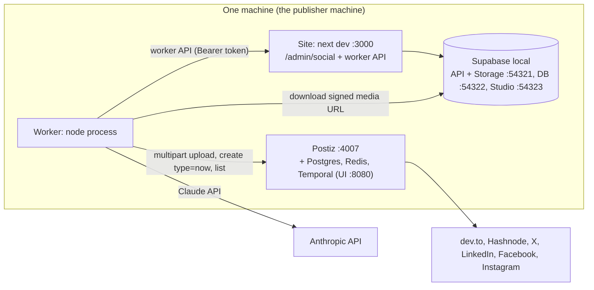

# Amendment 01: Localhost MVP

| | |
| --- | --- |
| Status | Draft, ready for review |
| Date | 2026-10-04 |
| Amends | [PRD](PRD.md) |
| Decision | No VPS for now. The MVP runs entirely on localhost. |

The PRD stays the target design. This amendment says what is different while everything runs on one machine, and it is written so that moving to a server later is a configuration change, not a rewrite.

---

## 1. What stays exactly the same

- Two tracks (A: site, B: worker/generator/Postiz) and the split of ownership.
- All contracts in PRD section 10: data model, state machines, worker API, draft and card spec, content hash, error codes. The worker still talks to the site only over HTTP, now `http://localhost:3000`.
- Approval rules, the figures check, the daily cap of 5 posts per account, content rules (PRD section 8), the stale window, the kill switch, dry-run mode.
- Postiz pinned to `v2.25.0`, used only through its public API, only by the worker.

## 2. What changes

| PRD item | Localhost MVP |
| --- | --- |
| VPS, Caddy, HTTPS, two subdomains | None. Everything on one machine, bound to `127.0.0.1` |
| Supabase: the site's real project | **Local Supabase** (`supabase start`, Docker). Production Supabase is never touched in the MVP |
| Site on Vercel | Site runs with `npm run dev` on `http://localhost:3000` |
| Postiz on the VPS | Postiz Docker Compose on the same machine, `http://localhost:4007` |
| Worker as a container | Plain Node process (`npm run dev` in `worker/`) |
| n8n (new-article trigger, notifications) | **Dropped from the MVP.** Generation is started from `/admin/social`; notifications are the event list on the Overview screen |
| Automation API (PRD 10.4) | Not built in the MVP. The site still writes `social_events` |
| Media: worker may use Postiz upload-from-url | **Multipart upload only.** Postiz blocks fetching loopback/private addresses (SSRF protection) and cannot reach the host's `127.0.0.1` anyway |
| OAuth callbacks on a public domain | `http://localhost:4007/integrations/social/<provider>` where the platform accepts it; otherwise a tunnel (section 5) |
| Backups and restore drill on a clean machine | A local dump script (section 8). Losing the Postiz volume means reconnecting accounts, nothing worse |
| Open question Q1 (domain) | Deferred until a tunnel or a server is needed |
| Open question Q7 (staging) | Answered: local Supabase per developer |

## 3. Local topology

| Service | URL | Started by | Track |
| --- | --- | --- | --- |
| Site (Next.js dev) | `http://localhost:3000` | `npm run dev` in the site repo | A |
| Supabase API and Storage | `http://127.0.0.1:54321` | `supabase start` in the site repo | A |
| Supabase DB / Studio | `127.0.0.1:54322` / `http://127.0.0.1:54323` | same | A |
| Postiz UI and API | `http://localhost:4007` (public API under its `/public/v1` path; B confirms the exact base) | `docker compose up -d` in `local/` | B |
| Temporal UI | `http://localhost:8080` | same | B |
| Worker | no port (optional health check `http://127.0.0.1:8787/health`) | `npm run dev` in `worker/` | B |

Machine requirements: Docker Desktop (WSL2 on Windows) with at least 8 GB memory assigned; 16 GB RAM on the machine is comfortable, because Postiz with Temporal and local Supabase both run in Docker. All published ports bind to `127.0.0.1` so nothing is reachable from the local network.

## 4. The publisher machine

Postiz holds the platform connections and local Supabase holds the posts, so **real publishing happens on exactly one machine**: the publisher machine. Default: Ale's machine, since Track B owns Postiz (question L1).

- Both developers run the full stack for development, with **throwaway accounts only** (a test dev.to account, a test Hashnode blog, a private test Facebook Page).
- Real brand accounts are connected only in the publisher machine's Postiz.
- Posts only go out while that machine is on, awake, and running all four parts. A post whose slot passes while the machine is asleep waits; after the 2-hour stale window it fails as `STALE` and must be rescheduled. Schedule inside working hours and turn off sleep on the publisher machine while posts are pending.
- The Overview screen shows "next scheduled post" next to "worker last seen", so a sleeping worker is obvious.

## 5. Platforms on localhost

| Platform | Auth | Works on plain localhost? | Media | MVP order |
| --- | --- | --- | --- | --- |
| dev.to | API key | Yes, no callback needed | Postiz uploads the cover itself | 1st |
| Hashnode | Personal access token | Yes, no callback needed | same | 1st |
| X | OAuth | B verifies whether X's developer portal accepts `http://localhost:4007` (or `http://127.0.0.1:4007`) as a callback; if not, tunnel | uploaded by Postiz | 2nd |
| LinkedIn page | OAuth | Postiz documents a local-development redirect URI, so expected yes; B verifies | uploaded by Postiz | 2nd (manual until Community Management API approval) |
| Facebook Page | OAuth | Postiz documents a local-development redirect URI (Meta allows localhost redirects for apps in development mode); B verifies | **Meta fetches images from a URL**: needs a public URL for Postiz uploads | 3rd |
| Instagram | OAuth | B verifies; Instagram Login may require HTTPS | **Meta fetches images from a URL**: needs a public URL | 3rd |
| Substack, Product Hunt | none | Yes (manual handoff) | downloaded by the admin | any time |

**Public media for Meta.** Facebook and Instagram need images at a URL Meta's servers can reach. Two options, decided when Meta is next (question L2):

- **Tunnel mode (recommended):** a stable tunnel hostname in front of Postiz only, for example a free static ngrok domain or a Cloudflare named tunnel. Postiz's `FRONTEND_URL` and `NEXT_PUBLIC_BACKEND_URL` (or `NEXT_PUBLIC_OVERRIDE_BACKEND_URL`, which Postiz provides for tunnel-based development) point at that hostname, and OAuth callbacks are registered on it. The same tunnel fixes X if X rejects localhost callbacks. Registration stays disabled in Postiz; nothing else is exposed.
- **Cloudflare R2 storage:** `STORAGE_PROVIDER=cloudflare` puts Postiz uploads in a public bucket. Solves media, not callbacks.

Avoid quick tunnels with a random hostname: every restart would change the OAuth callback URLs registered with each platform.

## 6. MVP scope

**In:** generator from the admin screen; drafts inbox; composer with validation and previews; brand cards and uploads; approval with figures check and cap; list of scheduled and published posts; delivery with poll and reconcile; manual handoff; account sync; events on the Overview screen; kill switch; dry run.

**Out until after the MVP:** n8n and the automation API, email or Telegram notifications, new-article auto-trigger, campaign presets, calendar grid (a list sorted by time is enough), slot suggestions, duplicate post, foreign-post detection, analytics, server backups.

## 7. Revised tasks

Original task IDs from PRD section 11. Unlisted tasks are unchanged.

### Track A (Raul)

| # | Change |
| --- | --- |
| A0 (new, first) | Get the site running against local Supabase: `supabase start`, apply the existing migrations to the empty local database, point the site's env at the local URL and keys (from `supabase status`), create a local admin user with MFA enrolled. If the existing migration history does not apply cleanly to a fresh database, fall back to a separate cloud Supabase project used only for development, never production. |
| A1 | Migration runs on local Supabase; `supabase db reset` must rebuild everything including seed brands. |
| A2 | Worker API only. Automation API deferred. |
| A9 | Calendar becomes a time-sorted list; manual handoff unchanged. |
| A10 (new) | Overview shows `social_events` (failures, stale, reconnect, manual due, drafts ready) with a "mark as seen" action, plus "worker last seen" and "next scheduled post". |

### Track B (Ale)

| # | Change |
| --- | --- |
| B1 | `.env.example` files for `local/` (Postiz) and `worker/`, with localhost values and no secrets. |
| B2 | Developer apps unchanged, but callbacks are registered on `http://localhost:4007` where accepted, or on the tunnel hostname. Record per platform which one in `docs/setup.md`. |
| B3 | The sandbox **is** the deployment: Postiz `v2.25.0` Compose in `local/`, ports bound to `127.0.0.1`, `DISABLE_REGISTRATION=true` after the first user, `RESEND_API_KEY` unset (users are activated without email). Confirm the public API base path, which fields give publish state and release URL, and whether plain-HTTP login needs any dev-only setting. Findings in `docs/postiz-notes.md`. |
| B4 | **Replaced** by: one command to start and stop the whole stack (`scripts/dev-up.mjs` / `dev-down.mjs`, cross-platform Node), a health check that prints the state of all four parts, and `scripts/backup-local.mjs` (section 8). |
| B5 | Worker runs as a host process; media goes download-then-multipart-upload; no upload-from-url. |
| B8 | **Dropped** for the MVP (n8n). |
| B10 (new) | Tunnel mode when Meta is next: static hostname, Postiz env switch, callback registration, written steps in `docs/setup.md`. |
| B11 (new) | End-to-end checklist run on the publisher machine for each platform as it is enabled (section 9). |

Track B is lighter without the VPS and n8n. Suggestion: Ale also takes **A6, the card renderer**, working in the site repo through PRs, since it is self-contained (a route plus templates, consuming the card spec Ale's generator already produces). Default if you don't agree on this: tracks stay as in the PRD.

## 8. Running it day to day

Start order on the publisher machine:

1. Docker Desktop running.
2. `supabase start` (site repo).
3. `docker compose up -d` in `local/` (Postiz), wait until `http://localhost:4007` loads.
4. `npm run dev` (site repo), check `http://localhost:3000/admin/social`.
5. `npm run dev` in `worker/` (with `WORKER_DRY_RUN=true` the first time after any change).

`scripts/dev-up.mjs` does 2–5 and prints a health summary.

Data safety:

- `supabase stop` keeps data. **`supabase db reset` wipes all posts and approvals.** Never run it on the publisher machine without a dump first.
- `scripts/backup-local.mjs` dumps the local Supabase `social_*` tables and the Postiz database to a dated folder outside the repo (default `~/agent-social-backups/`). Run it before upgrades, resets and weekly.
- The social data lives only on the publisher machine. When moving to a server, either import the dumps or start fresh; decide then.

Secrets: each machine has its own `.env` files (Postiz app keys, `POSTIZ_API_KEY`, `WORKER_TOKEN`, `ANTHROPIC_API_KEY`). They are git-ignored and never shared through the repo; share them through a password manager.

## 9. MVP milestones

| Milestone | Exit criteria |
| --- | --- |
| **L0 Contracts** (days 1–2) | PRD M0 minus the automation API. Questions L1–L3 answered or defaulted |
| **L1 Stack up** (end of week 1) | A: site on local Supabase with the migration, worker API, fake worker driving every state. B: Postiz local with a throwaway dev.to and Hashnode connected, worker passing mock-site tests, generator producing valid drafts |
| **L2 First real post** (week 2) | On one machine: generate → edit → approve → worker publishes to the throwaway dev.to → public URL shows in admin. Kill-mid-submit and duplicate tests pass |
| **L3 Social** | X and LinkedIn connected (localhost or tunnel); one controlled test post each |
| **L4 Meta** | Tunnel or R2 in place; Facebook and Instagram test posts with a generated card |
| **MVP done** | Checks below pass on the publisher machine; real brand accounts enabled one at a time |

MVP acceptance: PRD section 14 checks 1–8, 10 and 12. Check 9 (foreign posts) and 11 (restore on a clean machine) are replaced by: restoring `backup-local` dumps on the same machine brings back posts and Postiz connections.

## 10. Risks specific to localhost

| Risk | Mitigation |
| --- | --- |
| Publisher machine asleep or off at post time | Stale window prevents late posts; Overview shows worker health; schedule in working hours |
| `supabase db reset` or a deleted Docker volume loses data | Dump script before resets and weekly; Postiz loss only means reconnecting accounts |
| Platform rejects localhost OAuth callbacks | Tunnel mode with a static hostname |
| Meta cannot fetch images from localhost | Tunnel mode or R2 |
| Tunnel exposes Postiz publicly | Only Postiz behind it, registration disabled, strong password, tunnel stopped when not needed |
| The site's full migration history does not apply to a fresh local database | A0 fallback: a separate development Supabase project |
| Docker memory pressure on a laptop | 8 GB for Docker; stop Temporal UI if needed |

## 11. Moving to a server later

When the laptop becomes the bottleneck (missed slots, Meta needs a stable public URL, or n8n automations are wanted), follow the PRD as written:

1. Apply the social migration to the real Supabase project (or a staging one first).
2. Move the Postiz volume or dump to the server; re-register OAuth callbacks on the real domain.
3. Run the worker on the server with `SITE_BASE_URL` pointing at the deployed site.
4. Add n8n and the automation API.

No contract changes are needed; that is the point of keeping the worker API as HTTP from day one.

## 12. New open questions

| # | Question | Default |
| --- | --- | --- |
| L1 | Which machine is the publisher machine? | Ale's |
| L2 | For Meta: tunnel (ngrok static domain or Cloudflare named tunnel) or R2? | Tunnel with a free ngrok static domain |
| L3 | Does the site's migration history apply cleanly to local Supabase? (A0 answers this on day 1) | Fall back to a development Supabase project |
